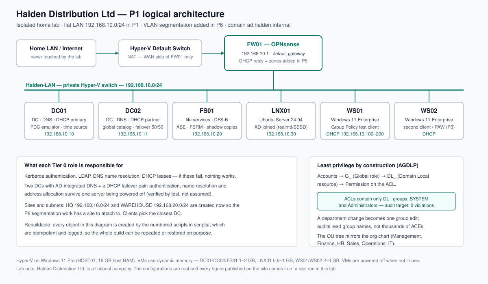

## The problem

Halden runs everything on one aging server — domain controller, file server and print server, with
no redundancy — and all 85 staff hold Full Control on the shared drive. If that server fails,
nobody can log in, get an IP address or open a file. Because permissions are wide open, one mistake
or one ransomware infection can destroy any department's data, and nobody can answer the simple
business question "who can read Finance data?". (Market context and the job-ad evidence behind this
project: `docs/plan/00-research-and-selection.md`.)

## What I built

- **Two replicating domain controllers** on Windows Server 2025 with AD-integrated DNS, so
  authentication and name resolution survive one server being down.
- **DHCP failover, 50/50, with name protection** and dynamic DNS updates performed by a dedicated
  low-privilege service account instead of a DC's computer account.
- **Sites and subnets now, segmentation later** — HQ and WAREHOUSE replication sites and `/24`
  subnet objects exist before the P6 firewall work needs them.
- **An OU tree that mirrors the org chart**, with protected OUs, a Tier 0 `_Admin` OU and a
  `Disabled` OU that the leaver process in P2 will use.
- **AGDLP least privilege**: accounts → `G_` role groups → `DL_` resource groups → permission.
  Only `DL_` groups, SYSTEM and Administrators may ever appear on an ACL, and an audit script fails
  the build if that is not true.
- **File services worth the name**: five departmental shares plus hidden home drives, a DFS
  namespace so shares can move servers without remapping drives, Access-Based Enumeration so users
  cannot even see what they may not open, FSRM quotas and file screens, and twice-daily shadow
  copies for self-service restores.
- **85 accounts provisioned from a CSV** by an idempotent script that sets department, title,
  manager and EmployeeID, forces a password change at first logon, and writes an audit log.
- **A Group Policy baseline** — password and lockout policy, drive maps with group item-level
  targeting, desktop standards, kiosk lockdown, server remote-management rules — with the ADMX
  Central Store and a committed backup of every GPO.
- **Ubuntu joined to AD** with `realmd`/SSSD, SSH allowed only to one AD group by key only, and
  sudo granted by AD group membership.
- **Documentation as a deliverable**: as-built document, logical diagram, six runbooks, a
  permission matrix for department-head approval and a one-page staff brief.

## How it works



Each DC points at its peer first and itself second for DNS, and at no point at a public resolver —
a DC that can only resolve itself is an island, and one pointed at a public resolver cannot resolve
AD at all. That is the difference between a design that works after a reboot and one that fails.

The permission model is the other half of the design. The one rule that keeps it honest is enforced
by code rather than discipline:

```powershell
# Only DL_ resource groups (plus SYSTEM / Administrators / CREATOR OWNER) may hold an ACE.
$ok = '^(NT AUTHORITY\\SYSTEM|BUILTIN\\Administrators|CREATOR OWNER|[^\\]+\\DL_.+)$'
$violations = @(Get-Acl $path).Access | Where-Object { $_.IdentityReference.Value -notmatch $ok }
```

An 86-line PowerShell script walks every share root, exits with the number of violations as its
exit code, and writes a CSV report — so "0 violations" is a test result, not a claim.

## Results

**Not measured yet.** The build kit (scripts, configs, documentation, business artifacts) is
complete and the lab execution is in progress. I am deliberately not publishing numbers before
they exist: the metrics below will be filled from real lab runs, each with a file in
`evidence/public/` as its source.

| Metric | Before | After | Source |
|---|---|---|---|
| DC replication failures (`repadmin /replsummary`) | not measured | not measured | pending |
| Service availability with DC01 powered off | not measured | not measured | pending |
| Direct user ACEs on share roots | not measured | not measured | pending |
| Accounts provisioned from CSV in one run | not measured | not measured | pending |

## Business side

The technical work is only half of an infrastructure project; the other half is what the business
receives and signs off:

- **Permission matrix** — department × share × access, with an approval column for department heads.
  Access is a business decision: IT implements it, the business owns it. The sign-off column is
  deliberately unsigned until a review actually happens.
- **One-page staff brief** — what is changing, why it matters, the five things users will actually
  notice, what they must do on day one, and who to contact. Written for a non-technical reader.
- **Change record** — risk, impact, phase plan, acceptance tests and the backout plan, in the shape
  a small company's change log expects. It feeds the governance dashboard in P10.
- **Six runbooks** — add a user, grant access, DC down, DHCP failover check, restore a previous
  version, and the weekly checks — so the environment is supportable by someone other than its
  author.

## What I learned / what I'd do differently

- **A permission model needs an automated control.** Writing the ACL audit script changed how I
  assigned access mid-build: it is much easier to stay disciplined when the check runs in seconds.
- **I would separate DHCP from the domain controllers next time.** It is documented as an accepted
  risk here, but placing a network service on a Tier 0 server increases the blast radius if either
  is compromised.
- **Idempotency is a design decision, not a detail.** Writing every script to be safe to re-run was
  slower at first and much faster by phase 5, because a failed step could simply be re-run.
- **Interview answers come from the runbooks.** The "user can't log in" runbook is literally the
  answer to that interview question — writing documentation was revision, not admin overhead.
> complete; lab execution runs phase by phase. Metrics, diagrams and evidence are published only
> from real runs (the Definition of Done is in `AGENTS.md`, Section 4.7), and progress is tracked
> in `PROGRESS.md`.
> complete; lab execution runs phase by phase. Metrics, diagrams and evidence are published only
> from real runs (the Definition of Done is in `AGENTS.md`, Section 4.7), and progress is tracked
> in `PROGRESS.md`.
> complete; lab execution runs phase by phase. Metrics, diagrams and evidence are published only
> from real runs (the Definition of Done is in `AGENTS.md`, Section 4.7), and progress is tracked
> in `PROGRESS.md`.

> Status: **in progress**. The build kit (scripts, configs, runbooks, business artifacts) is
> complete; lab execution runs phase by phase. Metrics, diagrams and evidence are published only
> from real runs (the Definition of Done is in `AGENTS.md`, Section 4.7), and progress is tracked
> in `PROGRESS.md`.
