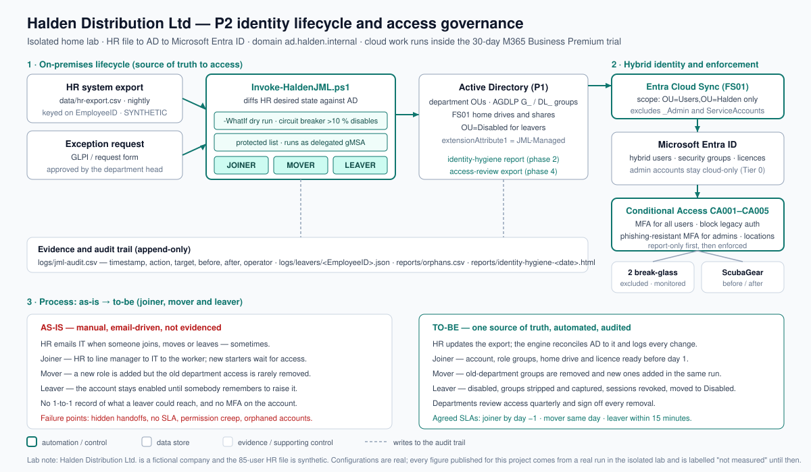

## The problem

HR emails IT when someone joins, moves or leaves — sometimes. New starters wait days for the access
they need, people who change department keep their old permissions, leavers' accounts stay enabled for
weeks, there is no MFA, and nobody can say who has access to payroll without sending an email. That is
a business risk rather than an IT detail: credential abuse is the most common initial access vector in
reported breaches — around 22% of them in the Verizon 2025 DBIR — and offboarding gaps and orphaned
accounts are among the most common findings in access audits. Worse, none of it can be *proved*: with
nothing recorded, the company cannot demonstrate that a leaver's access was removed. (Market evidence
and the job-ad analysis behind this project: `docs/plan/00-research-and-selection.md`.)

## What I built

- **An automated joiner-mover-leaver engine** that reconciles Active Directory to the HR source of
  truth, keyed on the employee ID rather than on names that change, collide and get misspelt.
- **A role model instead of copying a colleague's groups.** A role matrix defines what each department
  and job title should have, and it is the only place access is decided.
- **A mover path that removes as well as adds** — the old department's access is stripped in the same
  run that grants the new access, which is what stops permission creep over a career.
- **A leaver path in the order that matters**: capture the group memberships to a snapshot first, then
  disable, reset the password, remove the groups, move the account to the disabled area, and revoke
  the cloud sessions — because the snapshot is worthless once the groups are gone.
- **Safety controls that make scheduling it defensible**: a dry-run preview that changes nothing, a
  circuit breaker that aborts the run if more than 10% of the export would be disabled at once, a
  protected-accounts list, an append-only audit log, and idempotency so a second run does nothing.
- **Least privilege for the automation itself** — it runs as a group managed service account
  delegated rights over two directory areas, verified with `dsacls`, never as a domain administrator.
- **An identity-hygiene report** covering stale accounts, password-exempt accounts, retained disabled
  accounts, privileged-group membership and accounts with no HR record at all.
- **Hybrid identity scoped by tier**: AD synced to Microsoft Entra ID with admin and service accounts
  deliberately excluded, so privileged identities never leave the on-premises directory.
- **MFA and Conditional Access as version-controlled configuration**: five policies deployed by script,
  created in report-only, reviewed in the sign-in logs and only then enforced, with two monitored
  break-glass accounts created first so the control cannot become a lock-out.
- **An offline reference implementation with 34 unit tests**, so the classify, diff and circuit-breaker
  rules can be reviewed and proven without a domain controller in front of you.
- **Business artefacts as deliverables**: an executive brief, a joiner-mover-leaver process and RACI
  document written for a non-technical HR reader, a role model for department-head sign-off, a
  quarterly access-review pack with an action tracker, and the MFA rollout comms plan with a helpdesk
  surge plan.

## How it works



The HR export is the single source of truth. The engine diffs the desired state it describes against
the live directory and acts on the difference, while every action lands in one append-only audit log;
identities then sync to Entra ID, where Conditional Access enforces MFA and blocks legacy
authentication, with break-glass accounts excluded and monitored. The diagram's third panel puts the
as-is process beside the to-be process, because the improvement is the deliverable, not the script.

The rule that separates "helpful automation" from "the thing that disabled the company" is small
enough to quote:

```powershell
# Abort the whole run if more than -CircuitBreakerPercent of the accounts in the export
# would be disabled in one go. Nothing has been changed at this point.
$threshold   = $hr.Count * $CircuitBreakerPercent / 100
$tripped     = ($hr.Count -gt 0) -and ($leaverCount -gt $threshold)
if ($tripped) { Write-Audit -Action 'CircuitBreakerTripped' -Target $HrFile -After $msg; exit 3 }
```

Building the offline Python equivalent was not decoration: it is how I found that comparing one run's
leavers against the number of accounts in AD makes a single genuine leaver trip the breaker, because
the two counts do not share a denominator. The tests now pin that down.

## Results

**Not measured yet.** The build kit (scripts, configuration, documentation, business artefacts) is
complete and the lab execution is in progress. I am deliberately not publishing numbers before they
exist: the measures below will be filled from real lab runs, each with a file in `evidence/public/`
as its source and its measurement method written down in the KPI report.

| Metric | Before | After | Source |
|---|---|---|---|
| Joiner lead time (HR record to account ready) | not measured | not measured | pending |
| Leaver revocation time (HR record to sessions revoked) | not measured | not measured | pending |
| Enabled accounts with no HR record (orphans) | not measured | not measured | pending |
| Enabled accounts with no logon in 90+ days | not measured | not measured | pending |
| MFA coverage (% of users required to use MFA) | not measured | not measured | pending |
| CISA ScubaGear passing checks | not measured | not measured | pending |

## Business side

The technical work in an identity project is only half of it; the other half is the process the
business has to own:

- **Executive brief** — the issue in business language, the change, the cost (nothing) and the four
  things the business must do, including the one HR field that the whole leaver timer depends on.
- **Joiner-mover-leaver process and RACI** — who does what, written so a non-technical HR reader can
  follow it, with the SLA agreement between HR and IT stated explicitly and the failure point named
  rather than hidden.
- **Role-based access model** — the access each role receives, with a sign-off block for each
  department head. Access is a business decision: IT implements it, the business owns it. The sign-off
  column is deliberately unsigned and is recorded honestly as role-played in a lab.
- **Quarterly access-review pack** — one sheet per department showing user, groups, the resources
  those groups actually reach, last logon and manager, with a Keep/Remove/Change column, plus an
  action tracker that follows every decision to closure. "Follow up on action items" is part of the
  job, so the tracker is a deliverable rather than an afterthought.
- **MFA rollout comms plan** — the staff email, a one-page Authenticator setup guide, an FAQ covering
  the questions people actually ask, and a helpdesk surge plan, because a rollout where a fifth of
  staff cannot sign in is an outage rather than a security win.
- **KPI report** — the before/after template, with the measurement method for every row so a reader
  can check the number instead of trusting it.

## What I learned / what I'd do differently

- **Designing the process first changed the project.** Drawing the as-is flow showed the real problem
  was a missing HR field, not missing automation. An engine that reconciles to a record nobody
  maintains simply fails faster — so the fix started with an SLA and a process, not with PowerShell.
- **I would treat "the automation itself" as a security scope from day one.** My first instinct was to
  run the scheduled job as an administrator because it was convenient. Delegating two OUs to a gMSA
  and proving it with `dsacls` took an hour and removed the single biggest risk in the design.
- **A safety control has to be a number.** "Don't run it on a bad file" is a hope; "abort if more than
  10% of the export would be disabled" is a control. Writing the offline planner is what exposed the
  denominator bug in my first attempt at it.
- **Some steps refuse to be scripted, and saying so is part of the work.** The Cloud Sync agent is a
  GUI install. Everything around it is scripted, and the install is a runbook step with a screenshot
  rather than a claim that the whole thing is automated.
> complete; lab execution runs phase by phase. Metrics, diagrams and evidence are published only
> from real runs (the Definition of Done is in `AGENTS.md`, Section 4.7), and progress is tracked
> in `PROGRESS.md`.
> complete; lab execution runs phase by phase. Metrics, diagrams and evidence are published only
> from real runs (the Definition of Done is in `AGENTS.md`, Section 4.7), and progress is tracked
> in `PROGRESS.md`.

> Status: **in progress**. The build kit (scripts, configs, runbooks, business artifacts) is
> complete; lab execution runs phase by phase. Metrics, diagrams and evidence are published only
> from real runs (the Definition of Done is in `AGENTS.md`, Section 4.7), and progress is tracked
> in `PROGRESS.md`.
