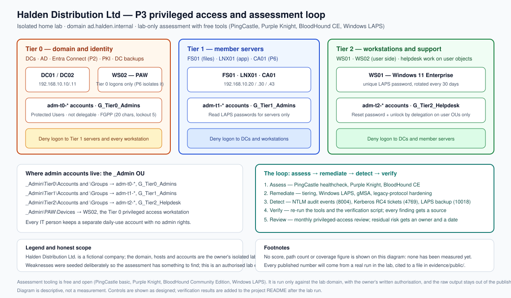

# P3: Active Directory Security Assessment and Privileged Access Hardening

> Home-lab project in an isolated, simulated 85-user company ("Halden Distribution Ltd.").
> Presented as a home lab on the portfolio site — never as employment experience.
> All account and staff data used here is **synthetic** (see [`data/README.md`](./data/README.md)).
>
> **Authorised lab assessment.** This project uses attack-path tooling (PingCastle, Purple Knight,
> BloodHound Community Edition) and is run **only** inside the owner's isolated lab, **only** against
> `ad.halden.internal`, and **only** after the owner's written authorisation is recorded (AGENTS.md
> rule R6). Every script has a lab guard and the assessment scripts refuse to run without an
> authorisation reference. **The weaknesses assessed here were deliberately seeded in the lab** so
> that the assessment had realistic problems to find.

**Status:** build kit complete — **lab execution pending** · **Build order:** 4 of 10 · **Depends on:** P1, P2
**Plan:** [`docs/plan/P03-ad-security-assessment-privileged-access.md`](../../docs/plan/P03-ad-security-assessment-privileged-access.md) · **Design:** [`docs/00-design.md`](./docs/00-design.md) · **As-built:** [`docs/as-built.md`](./docs/as-built.md) · **Site page source:** [`showcase.md`](./showcase.md) · **Progress:** [`PROGRESS.md`](../../PROGRESS.md)

## Problem

Halden has one shared local administrator password on every workstation, four people in Domain
Admins — including one who has been disabled and one who has never signed in — service accounts
whose passwords have not changed in years, an unconstrained delegation flag left on a file server,
and a domain that still accepts legacy authentication with a seven-character password policy.

Any of those alone is a finding. Together they mean one phished laptop can plausibly reach domain
control in hours rather than weeks, and domain control is exactly what ransomware operators want,
because it lets them push encryption to every machine at once. Credential abuse is the most common
initial access vector in the current industry data (22% of breaches, Verizon 2025 DBIR) and
ransomware reaches 88% of SMB breaches. Halden also cannot answer the simple question "who can
change the domain?" — and that is a governance problem, not just a technical one.

## What I built

- **A repeatable assessment**: PingCastle, Purple Knight and BloodHound CE run against the lab
  domain, with the baseline captured before any change and the same tools re-run afterwards, so the
  before/after comparison is like-for-like.
- **A risk-rated findings register**: every finding scored by Likelihood × Impact (1–25), banded
  P0–P3, with an owner, a target date and an evidence file — produced by a small Python tool whose
  scoring logic is covered by unit tests.
- **Phase 0 seeding, honestly labelled**: a `-WhatIf`-capable, lab-guarded script that creates the
  realistic weaknesses (Kerberoastable service account, AS-REP-roastable user, unconstrained
  delegation, excess privileged accounts, a shared local admin password, a weak policy, legacy
  protocols) so the "before" score means something.
- **Quick wins**: AD Recycle Bin enabled, Domain Admins reduced to the designed Tier 0 accounts plus
  the built-in break-glass Administrator, pre-authentication and delegation weaknesses cleared,
  Print Spooler disabled on the domain controllers, and a fine-grained password policy for
  administrators (20 characters, lockout 5).
- **Windows LAPS**: schema extension, computers allowed to write their own password, **encrypted**
  AD backup, delegated read rights by tier (helpdesk on workstations, server admins on servers,
  Tier 0 on the DCs including the DSRM password), 20-character passwords rotating every 30 days, and
  a post-authentication reset.
- **A three-tier privileged access model**: an `_Admin` OU structure, separate `adm-t{0,1,2}-*`
  accounts for every IT person, deny-logon Group Policy per tier written as user-rights settings,
  Protected Users for human Tier 0 accounts, a designated Tier 0 privileged access workstation
  (WS02), and delegated password-reset rights for the helpdesk instead of Domain Admin.
- **Service-account and Kerberos hygiene**: a gMSA to replace the legacy service account, Kerberos
  RC4 requests audited (event 4769) **before** AES-only is enforced, and the krbtgt rotation kept as
  a separate, deliberately non-automated change.
- **Legacy-protocol hardening in an audit-then-enforce sequence**: LM level 5, SMB signing required,
  SMBv1 removed, LDAP signing and channel binding, LLMNR disabled — with NTLM auditing (event 8004)
  first, because that is what change control actually looks like.
- **Verification rather than assumption**: a read-only script that re-checks every control the
  project claims and reports PASS / FAIL / UNKNOWN, plus a recurring privileged-access review.
- **The business layer**: a one-page executive summary, the findings register, the privileged access
  standard, a change record and a five-slide management deck.

## Architecture



*(the same diagram is published as the portfolio hero image at
[`evidence/public/p03-architecture.svg`](./evidence/public/p03-architecture.svg))*

Three tiers, three boundaries. **Tier 0** is the directory itself — DC01, DC02 and the privileged
access workstation — reachable only by `adm-t0-*` accounts. **Tier 1** is the member servers (FS01,
LNX01) and **Tier 2** is the workstations and the helpdesk's work on user objects. The boundaries are
enforced, not suggested: deny-logon Group Policy means a Tier 0 account cannot sign in to a
workstation, and the fixed asset with the strongest protection is the directory. Around the tiers
runs the loop the project is really about — **assess → remediate → detect → verify → review** — with
every step producing a file that can be cited.

The one idea that makes the model work in a small business is delegation rather than elevation. The
helpdesk does not need domain administrator rights to do its job; it needs the *Reset Password* and
*unlock* extended rights on the user organisational units, which the tiering script grants directly:

```powershell
# Reset Password (extended right 00299570-246d-11d0-a768-00aa006e0529) on user OUs only.
$rule = New-Object System.DirectoryServices.ActiveDirectoryAccessRule(
  $sid, [System.DirectoryServices.ActiveDirectoryRights]::ExtendedRight, 'Allow',
  [guid]'00299570-246d-11d0-a768-00aa006e0529')
```

The same idea in reverse is what closes the strongest attack path: a Tier 0 account that cannot sign
in to a workstation cannot have its credential cached there.

## How to reproduce

Run in order. Every script is idempotent, lab-guarded (it refuses to run outside
`ad.halden.internal` / a host carrying `/etc/halden-lab`), and supports `-WhatIf` where it changes
state. Every phase logs its actions to CSV.

| Order | Where | Script | Does | Phase |
|---|---|---|---|---|
| 0 | DC01 | `scripts/00-Test-AssessmentGate.ps1` | **Authorisation and prerequisite gate.** Refuses to pass without the owner's authorisation reference and confirmation that snapshots exist | 0 |
| 1 | DC01 | `scripts/01-Seed-Weaknesses.ps1` | **LAB ONLY.** Seeds the realistic weaknesses the assessment must find (idempotent, logged) | 0 |
| 2 | DC01 | `scripts/02-Collect-PingCastle.ps1 -Phase before` | Runs the PingCastle healthcheck and captures the baseline score | 1 |
| 3 | LNX01 | `scripts/03-Deploy-BloodHoundCE.sh --authorise` | Starts BloodHound CE in containers for the attack-path mapping (tear down after) | 1 |
| 4 | DC01 | `scripts/04-New-FindingsRegister.py --input …` | Scores the normalised findings into the risk-rated register | 1 |
| 5 | DC01 | `scripts/05-Invoke-QuickWins.ps1` | Recycle Bin, Domain Admin cleanup, pre-auth and delegation cleanup, Spooler, FGPP | 2 |
| 6 | DC01 | `scripts/06-Deploy-Laps.ps1` | Windows LAPS schema, delegated read, encrypted backup, DSRM for DCs, GPOs | 3 |
| 7 | DC01 | `scripts/07-Set-AdminTiering.ps1` | `_Admin` OUs, admin accounts, deny-logon GPOs, Protected Users, PAW, helpdesk delegation | 4 |
| 8 | DC01 | `scripts/08-Set-ServiceAccountHygiene.ps1` | gMSA, SPN migration, Kerberos audit first, krbtgt simulation only | 5 |
| 9 | DC01 | `scripts/09-Set-LegacyProtocolHardening.ps1` then `-Enforce` | NTLM auditing and posture recording, then enforcement | 6 |
| 10 | DC01 | `scripts/10-Test-PrivilegedAccess.ps1` | Read-only privilege and delegation audit: group hygiene, dangerous ACLs, stale admins | 4 |
| 11 | DC01 | `scripts/11-Verify-Remediation.ps1` | Re-checks every control and reports PASS / FAIL / UNKNOWN | 7 |
| 12 | Management host | `scripts/12-Invoke-PrivilegedAccessReview.sh` | The recurring, read-only privileged-access review | review |
| — | DC01 | `scripts/02-Collect-PingCastle.ps1 -Phase after` | Captures the after score for the before/after table | 7 |

**Prerequisites:**

- P1 complete: `ad.halden.internal` with DC01 and DC02, FS01, LNX01 and WS01; the `_Admin` OU, the
  AGDLP groups and the synthetic 85 accounts in place.
- **The owner's explicit written authorisation for the assessment**, with its change-record reference
  (`CHG-2026-004`). This is not optional: the gate script fails without it, and rules R1 and R6 exist
  because attack-path tooling is involved. The assessment is run only inside the isolated lab.
- **WS02 created** and joined as the Tier 0 privileged access workstation.
- Free tooling downloaded into the lab: PingCastle basic edition (`C:\Tools\PingCastle`), Purple
  Knight, BloodHound CE images for Docker on LNX01, SharpHound for collection, and Microsoft's
  `New-KrbtgtKeys.ps1` (simulation only).
- PowerShell 7 with the AD DS RSAT tools, Docker on LNX01, and the ADMX Central Store from P1.
- Python 3 for the register script and its tests (`python3 scripts/tests/test_findings_risk.py`).

**Snapshot before every phase**, named `snap-p3-ph<N>-before` — and snapshot **DC01 and DC02
together** before Phase 3, because `Update-LapsADSchema` is a one-way forest change.

**Rollback:** revert the snapshot and re-run the previous phase's scripts; they are idempotent. GPO
changes revert by returning the settings to "Not Configured". Two things cannot be rolled back and
are recorded as accepted one-way risks: the LAPS schema extension and a krbtgt reset (which is why
the reset is not automated and is handled as its own change). Reverting a domain controller snapshot
is a last resort: fix DC problems forward where possible.

## Results

**Not measured yet.** This build kit — scripts, configs, documentation, business artifacts and
diagram — is written but has not been executed in the lab, so this table is deliberately empty rather
than filled with plausible-looking numbers. Each row is a real measurement with a file in
`evidence/public/` as its source, added when the phase runs (AGENTS.md rule R2).

| Metric | Before | After | Source |
|---|---|---|---|
| PingCastle global risk score | not measured | not measured | — |
| PingCastle — Stale Objects | not measured | not measured | — |
| PingCastle — Privileged Accounts | not measured | not measured | — |
| PingCastle — Trusts | not measured | not measured | — |
| PingCastle — Anomalies | not measured | not measured | — |
| Purple Knight critical indicators open | not measured | not measured | — |
| BloodHound paths from Domain Users to Domain Admins | not measured | not measured | — |
| Workstations and member servers with a unique rotating LAPS password | not measured | not measured | — |
| Human accounts in Domain Admins for daily use | not measured | not measured | — |
| Service accounts converted to gMSA | not measured | not measured | — |
| Findings open by priority (P0/P1/P2/P3) | not measured | not measured | — |

## Acceptance tests

| Test | Expected | Actual | Pass |
|---|---|---|---|
| Run the assessment gate without an authorisation reference | Fails, and no assessment script can run | not run | ☐ |
| Re-run the seed script | Idempotent: no duplicates, no errors | not run | ☐ |
| Standard user reads a LAPS password | Denied | not run | ☐ |
| Helpdesk member reads a LAPS password | Succeeds (value blurred in every screenshot) | not run | ☐ |
| Tier 0 admin account attempts RDP to WS01 | Denied by Group Policy | not run | ☐ |
| Tier 0 human account signs in with Protected Users membership | Succeeds (Kerberos still works) | not run | ☐ |
| Helpdesk resets a Sales user's password | Succeeds | not run | ☐ |
| Helpdesk attempts to reset a Tier 0 admin's password | Denied | not run | ☐ |
| Re-run `11-Verify-Remediation.ps1` | Every claimed control reports PASS | not run | ☐ |
| Re-run `02-Collect-PingCastle.ps1 -Phase after` | Score is lower than the baseline, in all four categories recorded | not run | ☐ |
| Re-run the BloodHound "shortest paths to Domain Admins" query | No path from an ordinary account to Domain Admins | not run | ☐ |

## Business deliverables

| Artifact | For | File |
|---|---|---|
| Executive summary (1 page, plain English) | Managing Director and department heads | `business/p03-exec-summary.md` |
| Findings register (risk-rated, with owners, dates and accepted risks) | Management; reused in P10 | `business/p03-findings-register.md` |
| Privileged access standard (tiering, separate admin accounts, LAPS, service accounts, break-glass) | IT and the business owner; the policy behind the technical controls | `business/p03-privileged-access-policy.md` |
| Change record (risk, impact, phase plan, acceptance tests, backout) | Management / audit trail; feeds the P10 change log | `business/p03-change-record.md` |
| Management deck outline (5 slides) | The presentation to "management" | `business/p03-management-deck.md` |

## Lessons learned

- **Designing the scoring before running the tools was the right order.** Deciding Likelihood ×
  Impact and the four priority bands up front meant the assessment produced a decision-ready register
  rather than a pile of tool output — and the register schema is reusable in P5 and P10.
- **Authorisation has to be in the code, not in a sentence.** A README that says "lab only" is a
  promise; a gate script that refuses to run without an authorisation reference is a control. Writing
  it that way is also the honest answer to the interview question about running offensive tooling.
- **Audit → analyse → enforce is a design decision, not a delay.** Every protocol change here has an
  audit phase that produces the events the enforcement decision rests on. Skipping it would have been
  faster and would have broken something eventually.
- **The tiering model needs a test, not a diagram.** The deny-logon rules are only real once a Tier 0
  account has actually been refused a workstation logon, which is why that is an acceptance test
  rather than a claim. I would add the PAW's network isolation in the same phase next time instead of
  leaving it to P6, because "privileged access workstation" is not true while it sits on the same
  network as everything else.
- **Two things cannot be undone**, so they deserve respect: the LAPS schema extension and the krbtgt
  reset. I would put the krbtgt simulation in front of the owner earlier next time, because it is the
  change most likely to cause an outage if it is rushed.

## Interview notes

**"How would you explain a PingCastle score to a non-technical director?"** As a hygiene score, not a
verdict: "it counts how many of the well-known weak settings an attacker relies on are present in our
directory, grouped into stale objects, privileged accounts, trusts and anomalies. It is a to-do list
with numbers." Then the business sentence: a lower score means fewer shortcuts available to someone
who already has one valid account. I would never present the number alone, because a director's next
question is always "so can they get in?", and the honest answer is that this tool reports
configuration, not exploitation.

**"Why does a three-tier model matter, and how do you know yours works?"** Because the real risk is
credential exposure, not lack of intent: if a domain administrator reads email on their workstation,
compromising that workstation compromises the domain. Tiering means privileged credentials are only
ever typed into machines of the same tier, and the deny-logon rules make that enforced rather than
habitual. I know it works because I tested it — a Tier 0 account attempting RDP to a workstation is
refused, the helpdesk can reset a Sales user's password but cannot reset a Tier 0 administrator's,
and the verification script re-checks the controls after every change.

**"How do you prove a fix actually closed the path, rather than just changing a setting?"** Three
layers: (1) the specific behaviour test — the denied logon, the denied LAPS read, the successful
gMSA service account test; (2) the verification script, which re-reads the configuration and reports
PASS / FAIL / UNKNOWN; and (3) the re-assessment with the same tool run the same way, so the
attack-path query returns nothing from an ordinary account. A setting being present in a GPO is the
weakest of the three, which is why I do not stop there.

**"What would you check first in an Active Directory you have inherited?"** Who is in the privileged
groups and whether each account still has a living owner; whether LAPS is deployed or a local admin
password is shared; which service accounts have SPNs and when their passwords were last set; whether
any delegation is configured; the age of the krbtgt password; and what legacy protocols are still
accepted. Then I would run PingCastle for a baseline score and a findings list, and BloodHound to see
the paths that already exist — because a baseline turns a long list of opinions into a prioritised,
measurable plan that I can show a director and re-run after the work.
