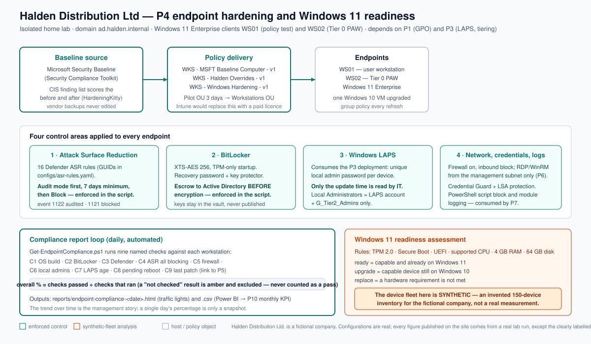

# P4: Endpoint Hardening Baseline and Windows 11 Readiness Program

> Home-lab project in an isolated, simulated 85-user company ("Halden Distribution Ltd.").
> Presented as a home lab on the portfolio site — never as employment experience.
> The Windows 11 readiness fleet in `data/` is **synthetic** (see [`data/README.md`](./data/README.md)).

**Status:** build kit complete — **lab execution pending** · **Build order:** 5 of 10 · **Depends on:** P1 (GPO structure), P3 (LAPS and tiering)
**Plan:** [`docs/plan/P04-endpoint-hardening-win11-readiness.md`](../../docs/plan/P04-endpoint-hardening-win11-readiness.md) · **Design:** [`docs/00-design.md`](./docs/00-design.md) · **As-built:** [`docs/as-built.md`](./docs/as-built.md) · **Site page source:** [`showcase.md`](./showcase.md)

## Problem

Halden's PCs were set up by whoever unboxed them. Every user is a local administrator, so anyone can
install software and switch off whatever protection gets in the way. BitLocker is off, so a lost sales
laptop is a data breach rather than an inconvenience. Defender runs on its defaults only, so the
behaviours ransomware depends on — macros spawning programs, script abuse, credential dumping — are not
blocked. About 30% of devices still run Windows 10, unsupported since 14 October 2025, and nobody has
ever told the business what fixing that would cost.

That is a business problem before it is a technical one: the company cannot answer "is a stolen laptop a
breach?", "is ransomware behaviour actually blocked?" or "what will Windows 10 cost us?". Industry data
shows about **21% of small-business Windows devices were still on Windows 10 in mid-2026** (Lansweeper,
via Computer Weekly), and Microsoft's commercial Extended Security Updates run for at most three years
and are paid for annually — so "we will deal with it later" has a price and a deadline.

## What I built

- **A measured baseline, not a guess.** Phase 0 captures the endpoint state (BitLocker, local admins,
  Defender configuration, ASR mode) and a CIS/Microsoft baseline score before anything changes, using
  the same method again afterwards — so the before/after claim has two real files behind it.
- **The Microsoft Security Baseline imported through Group Policy**, into a new GPO rather than by
  editing the vendor's backup, with a separate higher-precedence **`WKS - Halden Overrides - v1`** GPO
  for documented deviations, and a Policy Analyzer comparison against the P1–P3 GPOs before rollout.
- **Defender hardened with 16 Attack Surface Reduction rules**, deployed in **audit** mode with a
  minimum seven-day review enforced *in code*, then moved to **block** with only registered exceptions.
- **BitLocker XTS-AES 256 with TPM-only startup and Active Directory key escrow**, where the script
  refuses to encrypt until the escrow policy is confirmed — the ordering mistake that leaves a recovery
  key in nobody's hands.
- **Standing local administrator rights removed** (local Administrators = the LAPS-managed account and
  the IT admin group only), delivered by GPO with a published software-request process instead of a
  blanket refusal.
- **Firewall, Credential Guard, LSA protection and PowerShell logging** applied consistently, with the
  remote-management rules designed now and narrowed to the management subnet in P6.
- **An automated daily compliance report** across nine named controls, producing a traffic-light HTML
  report and a CSV for Power BI and the P10 monthly KPI. A check that cannot run is reported as amber
  and excluded, never counted as a pass.
- **A Windows 11 readiness assessment** with a deterministic **synthetic** 150-device fleet, the same
  classification rules used on real lab machines, and a costed three-option recommendation for
  management.
- **Documentation as a deliverable**: design document, as-built document, five runbooks (including a
  user-facing one), a hardware diagram in `.drawio` and `.svg`, and five business artefacts.

## Architecture

The baseline flows from the Microsoft Security Compliance Toolkit into new GPOs and out to the
endpoints; four control areas are enforced on every device (ASR, BitLocker, LAPS, and the network,
credential and logging protections); and the endpoints report into a daily compliance loop that
produces the management figure. The Windows 11 readiness assessment runs alongside it — over a real
inventory of the lab's few VMs, and over a clearly labelled synthetic fleet for fleet-scale planning.

## How to reproduce

Run in order. Every script is idempotent, lab-guarded (it refuses to run outside `ad.halden.internal`)
and supports `-WhatIf`. Nothing has been executed in the lab yet, so this table describes what each
script does, not what it has done.

| Order | Where | Script | Does |
|---|---|---|---|
| 0 | DC01 | `scripts/00-Get-EndpointBaseline.ps1` | Captures the "before" state (BitLocker, local admins, Defender, ASR) and, if HardeningKitty is present, a baseline audit export |
| 1 | DC01 | `scripts/01-Import-SecurityBaseline.ps1` | Imports the Microsoft baseline into a new GPO, creates the overrides GPO, links both to the pilot OU, backs up and exports both |
| 2 | DC01 | `scripts/02-Set-AsrAudit.ps1` | Enables Defender cloud/PUA/network protection and puts the 16 approved ASR rules into **audit** mode |
| 3 | DC01 | `scripts/03-Set-AsrBlock.ps1` | Moves the reviewed rules to **block** (refuses without 7 reviewed days), supports `-RevertToAudit` rollback and per-rule `-KeepAudit` |
| 4 | DC01 | `scripts/04-Enable-BitLockerEscrow.ps1` | Verifies the TPM, enables XTS-AES 256 with a recovery password, escrows the key to AD (refuses without the escrow policy confirmed) |
| 5 | DC01 | `scripts/05-Configure-LocalAdminAndHardening.ps1` | Writes the hardening GPO, or applies directly to a client in the lab: local admins, firewall, Credential Guard, LSA protection, PowerShell logging |
| 6 | DC01 | `scripts/08-Set-LapsIntegration.ps1` | Checks the P3 LAPS deployment reaches the clients and reports password age (update time only — never the password) |
| 7 | Management host | `scripts/06-Get-EndpointCompliance.ps1` | Runs the nine control checks and writes the HTML and CSV compliance report; schedule it daily |
| 8 | Management host | `scripts/07-Get-Win11Readiness.ps1` | Live hardware inventory of the lab clients, or classification of a device CSV (`-FleetCsv` for the synthetic fleet) |
| 9 | Any | `scripts/09-Test-Win11BuildReadiness.ps1` | Read-only check that a client's build meets the lab's Windows 11 target |
| 10 | Management host | `scripts/10-UpdateRingsHandoffToP5.sh` | Verifies the artefacts P5 needs exist and prints the update-rings hand-off |
| 11 | Any | `python3 data/gen_synthetic_fleet.py --count 150 --seed 42` | Regenerates the synthetic fleet and its summary file |
| 12 | Any | `python3 scripts/analyze_fleet.py --format html --out report.html` | Produces the readiness report from a fleet CSV |
| 13 | Any | `python3 scripts/parse_baseline.py --csv <export>.csv` | Summarises a HardeningKitty/CIS-CAT export into a pass/fail report |
| 14 | Any | `python3 scripts/tests/run_tests.py` | Runs the Python unit tests (also runs under `pytest scripts/tests`) |

**Prerequisites:** P1 complete (GPO structure, the `WKS - Security Baseline - v1` placeholder, the
Workstations and Pilot OUs), P3 complete (Windows LAPS and privileged-access tiering), WS01 and WS02
with a **vTPM** (required for Windows 11 and for TPM-only BitLocker), the Microsoft Security Compliance
Toolkit unzipped outside the repository, and PowerShell 7 + RSAT. Lab credentials stay in the owner's
password manager; BitLocker recovery keys and LAPS passwords are never written to a file, a screenshot
or this repository.

**Snapshot before every phase** (`snap-p4-ph<N>-before`). **Rollback:** ASR rules return to audit with
`03-Set-AsrBlock.ps1 -RevertToAudit`; a GPO is unlinked with `Remove-GPLink`; BitLocker is disabled with
`Disable-BitLocker` while the key is still escrowed (never by deleting the escrow record); local admin
removal is reversed by re-adding the membership; anything else is a revert of the phase snapshot and a
re-run of the previous phase.

## Results

**Not measured yet.** This build kit has been written but not yet executed in the lab, so this table is
deliberately empty rather than filled with plausible-looking numbers. Each row becomes a real
measurement with a file in `evidence/public/` as its source when the phase runs.

| Metric | Before | After | Source |
|---|---|---|---|
| Baseline compliance score (CIS/Microsoft, HardeningKitty or CIS-CAT Lite) | not measured | not measured | — |
| ASR rules in block mode (of 16 approved) | not measured | not measured | — |
| Clients with BitLocker protection on and 100% encrypted | not measured | not measured | — |
| Recovery keys escrowed to Active Directory | not measured | not measured | — |
| Time to recover a device with an escrowed key | not measured | not measured | — |
| Standard users holding local administrator rights | not measured | not measured | — |
| Endpoint controls passing (of the nine in the daily report) | not measured | not measured | — |
| Windows 11 readiness across the fleet | not measured | not measured | — (only synthetic-fleet planning figures exist; see the readiness report) |

Two figures do exist before the lab run, and they are **synthetic**, produced by actually running the
generator rather than being invented: the synthetic 150-device fleet classifies as **78 ready, 41
upgrade, 31 replace**, with a Windows 10 population of 72 devices (48%). They are a planning exercise
over an invented dataset, labelled as such in [`data/README.md`](./data/README.md), in
[`data/synthetic-fleet-summary.md`](./data/synthetic-fleet-summary.md) and in the readiness report —
never presented as a measurement of real hardware.

## Acceptance tests

| Test | Expected | Actual | Pass |
|---|---|---|---|
| Run the compliance report on the pilot after the baseline import | Every control that Phase 1 covers passes; ASR fails until Phase 2 runs | not run | ☐ |
| Audit the ASR rules for seven days and raise a deliberate test trigger | Event 1122 recorded for the rule, showing it would have blocked | not run | ☐ |
| Move the rules to block and repeat the test trigger | Blocked, with event 1121 recorded | not run | ☐ |
| Run `03-Set-AsrBlock.ps1` with fewer than seven reviewed days | Refuses unless `-Force` is given | not run | ☐ |
| Force the pilot into BitLocker recovery, retrieve the key as a helpdesk user, unlock | Device boots; the key never leaves the vault; the time taken is recorded | not run | ☐ |
| Run the BitLocker script before the escrow policy is confirmed | Refuses unless `-EscrowPolicyConfirmed` is given | not run | ☐ |
| Add a standard user to local Administrators on a client, then run the compliance report | Control C6 fails | not run | ☐ |
| Remove them and re-run the report | Control C6 passes | not run | ☐ |
| Compare the compliance percentage with the CSV | The HTML figure is reproducible from the CSV by hand | not run | ☐ |
| Run `07-Get-Win11Readiness.ps1 -FleetCsv data/synthetic-fleet.csv` | Counts match `data/synthetic-fleet-summary.md` exactly | not run | ☐ |
| Re-run the fleet generator with the same seed | Byte-identical CSV | not run | ☐ |
| Re-run the user import/hardening scripts a second time | Idempotent: no duplicate changes, no errors | not run | ☐ |
| Run the update-rings hand-off script | Reports the P4 artefacts P5 needs, and fails loudly if one is missing | not run | ☐ |

## Business deliverables

| Artifact | For | File |
|---|---|---|
| Executive brief (1 page) | Managing Director and department heads | [`business/p04-exec-brief.md`](./business/p04-exec-brief.md) |
| Endpoint security standard (what is enforced and why) | Management approval; the rule for every Halden PC | [`business/p04-endpoint-standard.md`](./business/p04-endpoint-standard.md) |
| Windows 11 readiness report with a costed three-option recommendation | Management decision and budget | [`business/p04-win11-readiness-report.md`](./business/p04-win11-readiness-report.md) |
| ASR exception register (empty by design until the audit run) | Change control and the monthly review | [`business/p04-asr-exceptions.md`](./business/p04-asr-exceptions.md) |
| Change record (risk, test plan, backout) | Management and the audit trail; feeds the P10 change log | [`business/p04-change-record.md`](./business/p04-change-record.md) |
| Staff communication (what changes, what users will notice, and the software-request process) | All staff | [`business/p04-user-comms.md`](./business/p04-user-comms.md) |

The readiness report is based on a **synthetic** fleet, labelled prominently on every section. Its
counts are plain arithmetic over the generated CSV and are reproducible by re-running the generator; no
conversion rate or cost figure is invented, and the vendor and ESU prices are explicitly marked as
placeholders until a current quote is attached.

## Lessons learned

- **Enforce the sequencing in code, not in the runbook.** "Remember to set up escrow before encrypting"
  and "audit the ASR rules for a week first" are exactly the instructions that get skipped at 18:00 on a
  Friday. Making the script refuse without a confirmation flag turns a good intention into a control.
- **Audit-before-block is a business decision dressed as a technical one.** The reason to audit first is
  not defender telemetry; it is that enforcing an ASR rule on a Monday morning can stop the month-end
  close, and a hardening project that breaks reporting gets switched off by the business within a week.
- **A compliance figure is only useful if a check that could not run is visible.** The first draft of
  the report counted everything it could not measure as a pass, which quietly inflated the score. Amber
  "not checked", excluded from the percentage, is the honest version.
- **Be blunt about synthetic data.** The lab has two Windows 11 VMs and one Windows 10 VM. That is
  enough to prove the procedure and nowhere near enough to talk about a fleet, so the fleet analysis is
  over an invented dataset — and every place that number appears says so. A number that looks like a
  survey but is invented is the fastest way to lose an interviewer's trust.
- **Writing the upgrade runbook before doing an upgrade changed the recommendation.** Walking through
  the steps on paper surfaced the application-check and rollback-window risks that the three-option
  cost table would otherwise have ignored.

## Interview notes

**"How do you deploy ASR rules without breaking the business?"** Audit mode first, for a defined period,
with a deliberate test trigger so you know the rules actually fire rather than merely being configured.
Then review the audited events per rule and per department, decide block / keep-in-audit / narrow
exclusion, and only then enforce — on a pilot ring before the fleet. Keep a register of exceptions with
a named owner and an expiry date, monitor the block events afterwards, and make the rollback a single
command, because the day you need it is not the day to be writing it. In this project the sequencing is
enforced by the script: `03-Set-AsrBlock.ps1` refuses to run without at least seven reviewed days.

**"A user tells you a legitimate email attachment is blocked. Walk me through it."** First, confirm
what was blocked and which rule fired — event 1122 in audit mode or 1121 once blocking — so the answer
is based on the log and not on the description. Then check the sender with the user by a channel other
than the email itself, because a blocked attachment is often the control correctly stopping a phishing
attempt. If it is genuinely business content, the safe path is to have the file placed somewhere the
business already trusts (a file share, or the application itself) rather than excluding the rule on one
machine: a one-off exclusion becomes permanent the moment nobody remembers it. If a rule is genuinely
incompatible with a business process, it goes in the exceptions register with a risk, an owner and an
expiry, and the business process owner is told what is being accepted.

**"Why is a missing BitLocker key escrow an audit finding if the disk is encrypted?"** Because
encryption is only half the control. Without an escrowed key, a hardware fault or a firmware update is
permanent data loss, and the gap is discovered at the worst possible moment — when the device will not
boot and the user needs what is on it. An auditor therefore looks for three things, not one: encryption
is on, the key is escrowed somewhere the organisation controls, and retrieval has actually been tested
against a documented identity-verification process. That third one matters because recovery-key
retrieval is a genuine social-engineering target — a helpdesk that reads a key to whoever calls is a
data-breach route with a friendly voice. In this project the escrow is enforced before encryption by the
script, the test is a forced recovery, and keys are read from the vault and never published.

**"Windows 10 is out of support. What do you tell the CFO?"** Risk, options and cost, in that order,
and no engineering detail in the first paragraph. The risk: those devices receive no security updates,
they are the most likely starting point for ransomware, and the business cannot answer an insurer's or a
customer's due-diligence question about them. The options: upgrade what is capable, replace what is not;
or upgrade the capable devices and buy Extended Security Updates as a one-year bridge; or do nothing and
accept an unpatched estate. The costs, including the fact that ESU rises every year and covers at most
three — so it delays the spend rather than removing it. Then a recommendation with a date, because a
report without a decision in it is just homework. I would also be clear about which numbers are real and
which are planning estimates: in this project the fleet is a labelled synthetic dataset, and the vendor
and ESU figures stay marked as placeholders until a current quote is attached.

## Folder map

| Folder | Contents |
|---|---|
| `scripts/` | PowerShell / Python / bash automation (idempotent, lab-guarded — AGENTS.md 4.4) |
| `configs/` | Baseline definition, ASR rule table, compliance control mapping, readiness rules, templates |
| `docs/` | Design document, as-built document, runbooks, diagram (`.drawio` + `.svg`) |
| `business/` | Executive brief, endpoint standard, readiness report, exception register, change record, staff brief |
| `data/` | The **synthetic** device fleet, its generator, and the shared readiness rules |
| `evidence/raw/` | Original screenshots/outputs — **git-ignored, never published** |
| `evidence/public/` | Sanitized evidence safe to publish (currently the architecture diagram only) |
