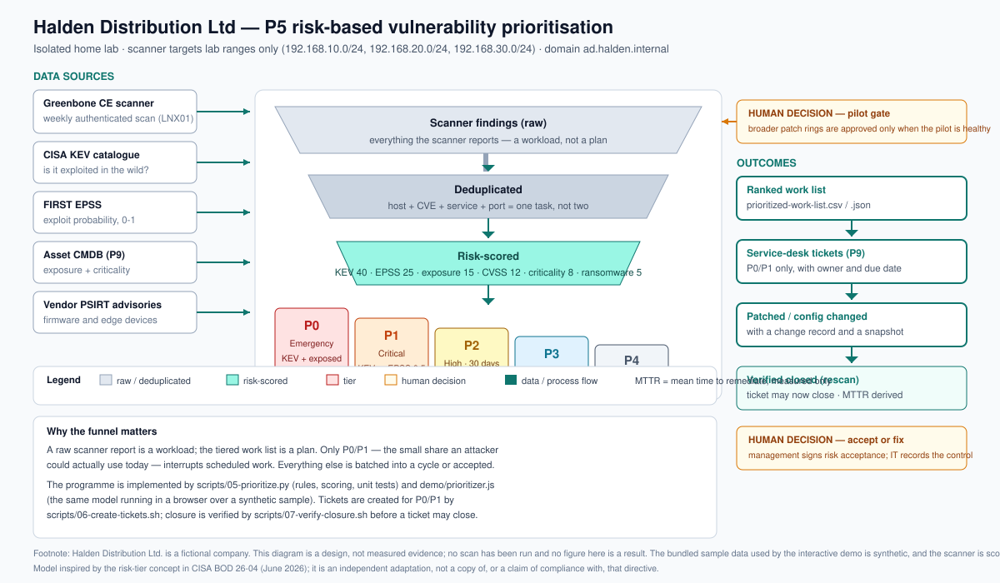

## The problem

Halden patches "when someone has time". Nobody knows which machines are missing which updates, the
firewall firmware is two years old, and a scan by the cyber-insurance provider returned 400 "critical"
findings. IT cannot fix 400 things, and management cannot tell which ones matter. That matters more in
2026, not less: exploitation of vulnerabilities as an initial access vector **rose 34%**, concentrated
on edge devices and VPNs — exactly the equipment an SMB leaves unpatched the longest
(Verizon DBIR 2025, via `docs/plan/00-research-and-selection.md`).

## What I built

- **A risk-based prioritizer, not a report reader.** A Python engine ingests a scanner export and an
  asset inventory, enriches every finding with **CISA KEV** (is it already exploited?) and **FIRST
  EPSS** (how likely is it to be used?), joins exposure and business criticality, and produces a
  tiered P0–P4 work list with an SLA date and a 0–100 score. The rule order is a pure, unit-tested
  function, so "why is this a P1?" has one auditable answer.
- **A model inspired by CISA BOD 26-04.** The June 2026 directive replaced flat patch deadlines with
  risk tiers; here the same idea applies at SMB scale — exposure and confirmed exploitation outrank
  raw severity, and a known-exploited flaw on an internet-facing host is checked for compromise
  before and after patching.
- **Ring-based Windows patching with a real gate.** Three rings (Pilot → Broad → Servers) via WSUS and
  Group Policy client-side targeting, a **coded pilot gate** that refuses broader approval until the
  pilot is healthy, and a server script that patches **DC02 then DC01, never together**, with pre- and
  post-health checks that stop the run on the first failure.
- **Automated Linux patching** with an Ansible playbook (one host at a time, reboot only if required,
  SSH asserted afterwards) plus unattended security updates between cycles.
- **Weekly authenticated scanning** with Greenbone Community Edition, behind a **hard lab-range safety
  guard**: a wrong address aborts the run rather than scanning it.
- **A closure loop, not a spreadsheet.** P0/P1 items become service-desk tickets with an owner and a
  due date; a ticket closes only when a re-scan stops reporting the finding, and MTTR is derived from
  the two scans rather than estimated.
- **An interactive browser demo** (`demo/index.html`) that runs the same model over a bundled
  **synthetic** sample with no backend and no network — the funnel, the tier distribution and the
  reason behind every priority, live in the page.
- **The business layer**: a policy with **targets** rather than slogans, an exception/risk-acceptance
  register, a monthly report template, a vendor advisory log, an executive brief and a change record.

## How it works



Findings come in on the left, are deduplicated (one remediation task per host, CVE, service and port),
risk-scored, and come out as a much shorter tiered list that becomes tickets, changes and verified
closures. Data sources, the human decision points (the pilot gate, accept-or-fix) and the closure
step are all marked, because the model prioritises work — it does not authorise downtime or accept risk.

The whole project lives or dies on four lines of tier logic:

```python
def tier(in_kev, exposed, epss, cvss, criticality, rules=DEFAULT_RULES):
    if in_kev and exposed:                                      return "P0"
    if in_kev or (exposed and epss >= rules.epss_critical):     return "P1"
    if epss >= rules.epss_high or (cvss >= rules.cvss_critical and criticality >= 3): return "P2"
    if cvss >= rules.cvss_high:                                 return "P3"
    return "P4"
```

Keeping that function free of I/O is what makes it testable without a scanner, a network or a lab host.
Everything — thresholds, weights, SLA targets — is data (`configs/p05-tier-rules.yml`), and the
production engine, the config and the browser demo all agree because the same rule order is asserted
by unit tests.

## Results

**Not measured yet.** The build kit (scripts, configs, documentation, business artefacts) is complete
and lab execution is in progress. I am deliberately not publishing numbers before they exist: the
metrics below will be filled from real lab runs, each with a file in `evidence/public/` as its source.

| Metric | Before | After | Source |
|---|---|---|---|
| Scanner findings (raw, then after deduplication) | not measured | not measured | pending |
| Findings in the urgent queue (P0 + P1) and their share | not measured | not measured | pending |
| Findings matched to CISA KEV, and those on exposed assets | not measured | not measured | pending |
| Patch compliance within the ring deadlines | not measured | not measured | pending |
| Mean time to remediate (MTTR) by tier | not measured | not measured | pending |

The only figure shown anywhere on this project is a property of the **synthetic sample** the
interactive demo runs on — 51 scanner rows reducing to 49 unique findings and 9 urgent items — and it
is labelled as synthetic every time it appears.

## Business side

An IT project that cannot be explained to management is a hobby:

- **Executive brief** — why "fix everything by Friday" is not a plan, what the business agreed to do
  instead, and the four things IT needs from management (approve the standard, approve downtime
  windows, nominate asset owners, decide on the ageing firewall).
- **Policy** — scope, the four-tier model, remediation **targets**, maintenance windows, roles, and an
  exception process where a named owner accepts a risk with a compensating control and an expiry of no
  more than 90 days. The approval block is deliberately unsigned until a real review happens.
- **Exception register** — with an empty table and one clearly-labelled worked example, so the shape of
  a proper risk acceptance is visible without pretending one has occurred.
- **Monthly report template** — open items by tier, overdue by tier, KEV exposure, patch compliance,
  and a short "asks for management" section. Every figure names the source file it came from.
- **Vendor advisory log** — the part a scanner cannot see: firmware advisories, applicability and the
  action taken, including the decision to replace an end-of-life device rather than patch it forever.
- **Change record** — the programme build plus a worked record for a P0 remediation, showing the
  compromise check *before* patching that the 2026 guidance made explicit.

## What I learned / what I'd do differently

- **The hard part was deciding what not to fix.** Writing the tier rule forced every assumption into
  the open, and the most valuable output of the project is a short list rather than a long one.
- **Tooling is only trustworthy if it can refuse.** The lab-range guard went in before the scanner did;
  a vulnerability scanner pointed at the wrong address is not a slip, it is an incident.
- **Honesty is a design constraint.** MTTR is explicitly withheld because one scan cannot produce it,
  and every table says "not measured". A project about risk discipline that invented its own
  effectiveness numbers would undermine its own argument.
- **I would sequence two things differently next time:** start the Greenbone feed sync a day early (it
  takes hours), and define asset criticality with the business before writing the model — the tiers
  are only as good as the criticality data underneath, which is why P9's CMDB improves this project.
> (the Definition of Done is in `AGENTS.md`, Section 4.7). Progress is tracked in `PROGRESS.md`.

> Status: **in progress**. The build kit (scripts, configs, runbooks, business artifacts) is
> complete; lab execution runs phase by phase. Metrics, diagrams and evidence are published only
> from real runs (the Definition of Done is in `AGENTS.md`, Section 4.7), and progress is tracked
> in `PROGRESS.md`.
