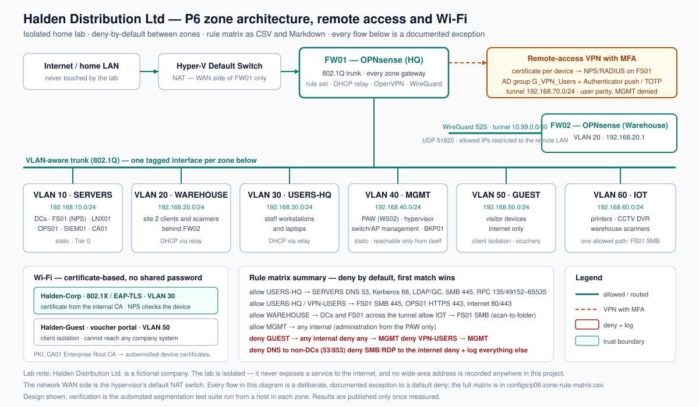

## The problem

Halden runs guest Wi-Fi, the CCTV recorder, printers, warehouse scanners, staff laptops and the servers
on one flat subnet — so one infected laptop can talk directly to the domain controllers, the file
server and the backup server. The Wi-Fi password has been unchanged for three years and is written on
the break-room wall, so everyone who ever asked for it still knows it, and remote staff reach the file
server through a remote desktop port exposed to the internet. Exploitation of edge devices and VPNs was
a leading growth vector in the Verizon DBIR 2025, and exposed remote desktop is one of the most common
ransomware entry points. (`docs/plan/00-research-and-selection.md`.)

## What I built

- **Six firewall-enforced VLAN zones** (servers, warehouse, staff, management, guest, devices) plus a
  VPN pool, replacing a single flat subnet, with **deny by default** between all of them.
- **A rule matrix where every exception has a number, an owner and a justification** — 24 rules applied
  in a documented order, because the firewall evaluates top-down and the first match wins. Aliases
  (`DCs`, `AD_PORTS`, `RFC1918`) keep the rules readable and a subnet change to a single edit.
- **DNS and egress control**: clients resolve names only through the domain controllers, outbound DNS
  to anyone else is blocked and logged, and outbound file-sharing and remote-desktop traffic to the
  internet is blocked outright.
- **The exposed remote desktop is gone**, replaced by a road-warrior VPN with a certificate per device,
  authenticated through RADIUS against an AD group and protected by a second factor on the user's
  phone.
- **Least-privilege remote access**: a remote user gets the same access as being in the office and is
  explicitly denied the management zone, where the admin workstation, the hypervisor and the backup
  repository live.
- **A WireGuard site-to-site tunnel** joining the warehouse firewall to HQ, carrying DHCP relay
  traffic, AD authentication and file access for site 2 over one restricted peer relationship.
- **Certificate-based 802.1X Wi-Fi (EAP-TLS)** on an internal certificate authority, with certificates
  autoenrolled by Group Policy — no password on the air for an evil-twin access point to harvest.
- **An isolated guest network** with client isolation, a voucher process at reception and a written
  acceptable-use notice.
- **An automated segmentation test suite**: 47 defined connections across the zones, run from a host in
  each zone, written to a results file, plus a separate guest and IoT isolation test. Configuration is
  not proof; the test is.
- **Documentation as a deliverable**: design and as-built documents, four runbooks, an L3 diagram, an
  IP plan, and a business layer from executive brief to staff VPN guide.

## How it works



Six VLAN zones hang off one 802.1Q trunk on the HQ firewall, and every flow between them is a
documented exception to a default deny. The three flows that matter most: a staff workstation reaches
the domain controllers on a specific port list; a remote user reaches the same services over the VPN
but nothing in the management zone; and a guest reaches the internet and nothing else at all. The
warehouse is carried across one restricted WireGuard peer relationship rather than a copy of the HQ
rule set.

The whole design reduces to a few lines an auditor can challenge, taken from the rule matrix:

```text
18,ANY-INTERNAL,INTERNET,SMB-RDP,445,3389,deny,IT,Remove the usual lateral-movement and exfiltration routes
19,GUEST,ANY-INTERNAL,ANY,any,deny,IT,Guest isolation from every company system
22,ANY,MGMT,ANY,any,deny,IT,The management zone is reachable only from MGMT itself
24,ANY,ANY,ANY,any,deny-and-log,IT,Default deny: everything not explicitly allowed above
```

Order is the design: rule 1 allows the management zone to reach everything, and rules 22 and 23 deny
everything else from reaching it — which works because the first matching rule wins.

## Results

**Not measured yet.** The build kit — scripts, rule matrix, configs, runbooks, business artefacts and
test suite — is complete, and lab execution is pending. I am deliberately not publishing numbers before
they exist: the metrics will be filled from real lab runs, each with a file in `evidence/public/` as its
source. The segmentation suite is written and ready, and its results file stays empty until it is run
from a host in each zone.

| Metric | Before | After | Source |
|---|---|---|---|
| Segmentation test outcomes (hosts in every zone) | not measured | not measured | pending |
| Guest and IoT isolation outcomes | not measured | not measured | pending |
| Remote desktop reachable from the lab WAN | not measured | not measured | pending |
| VPN logon denied for a non-member (NPS event 6273) | not measured | not measured | pending |
| VPN logon granted with a second factor (NPS event 6272) | not measured | not measured | pending |
| `eapol_test` result against NPS (EAP-TLS) | not measured | not measured | pending |

## Business side

The technical work is half of a network project; the other half is what the business receives and
approves:

- **Executive brief (1 page)** — why segmentation matters, framed as "one compromised laptop versus the
  whole company", with the market evidence and what the change does *not* fix.
- **Network access policy** — who may reach what, how remote access is requested and approved, the
  guest terms, and how an exception is raised so it cannot quietly become permanent.
- **Zone and service matrix in business language** — the same decisions with no ports to decode, so a
  manager can check them without an engineer in the room.
- **Guest Wi-Fi acceptable-use notice** — displayed before a voucher is issued, with clear rules and a
  short note telling reception not to improvise.
- **Change record** — risk, impact, phase plan, test plan, comms plan and backout, written for the
  most dangerous change in the portfolio: the one that can break sign-in, file access and Group Policy
  at once, and can lock IT out of its own firewall.
- **Working-from-home VPN guide** — a one-page setup and troubleshooting sheet for staff, which is
  what turns a technical control into something people can actually use.

## What I learned / what I'd do differently

- **The rule matrix is a design tool, not documentation.** Writing it before configuring anything
  forced the awkward questions early — which zone needs which port, who owns the exception, what
  happens when someone forgets one. Written afterwards, it would have described whatever I happened to
  build.
- **I would automate the firewall rules from the matrix on day one.** Applying rules through a GUI and
  keeping the matrix in a file means the two can drift; driving the rules from the matrix through the
  API makes the file the source of truth, which is what P9's config-as-code work then keeps honest.
- **Order of operations is a safety control, not a preference.** VLANs, interfaces, anti-lockout path,
  aliases, then rules. I would also test the relay and a lease in a zone before moving the next zone,
  rather than after the change.
- **Proving it changed how I think about the project.** Designing the test suite up front — deciding
  which paths must be open and which must be blocked, from whose perspective — was more valuable than
  any single firewall rule, because it is the only thing that turns "segmented" from a claim into a
  result.
> complete; lab execution runs phase by phase. Metrics, diagrams and evidence are published only
> from real runs (the Definition of Done is in `AGENTS.md`, Section 4.7), and progress is tracked
> in `PROGRESS.md`.
> complete; lab execution runs phase by phase. Metrics, diagrams and evidence are published only
> from real runs (the Definition of Done is in `AGENTS.md`, Section 4.7), and progress is tracked
> in `PROGRESS.md`.
> complete; lab execution runs phase by phase. Metrics, diagrams and evidence are published only
> from real runs (the Definition of Done is in `AGENTS.md`, Section 4.7), and progress is tracked
> in `PROGRESS.md`.

> Status: **in progress**. The build kit (scripts, configs, runbooks, business artifacts) is
> complete; lab execution runs phase by phase. Metrics, diagrams and evidence are published only
> from real runs (the Definition of Done is in `AGENTS.md`, Section 4.7), and progress is tracked
> in `PROGRESS.md`.
