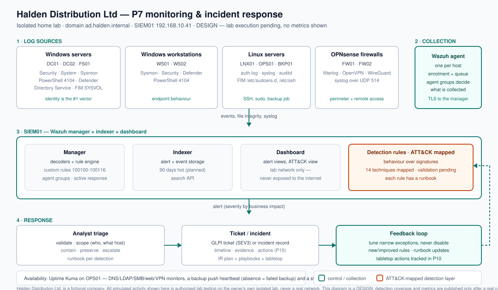

## The problem

At Halden nobody would notice an attacker until the ransom note appeared: logs live on each machine
and overwrite within days, nothing watches them, and there is no written answer to "who do we call?".
Ransomware appears in **88% of small-business breaches** (Verizon DBIR 2025) and attackers typically
spend days escalating privilege before they encrypt — a window that is only useful if someone is
watching it. Two job-ad responsibilities sit directly behind this project: monitor health,
availability, logs, alerts and security events, and identify and respond to security incidents.
(Market context and the job-ad evidence: `docs/plan/00-research-and-selection.md`.)

## What I built

- **One place that watches the whole environment** — a Wazuh SIEM (manager, indexer and dashboard) on
  a dedicated server, collecting security events from every server and workstation plus syslog from
  both firewalls, deployed as a declarative Docker Compose stack.
- **Endpoint telemetry that actually supports detection** — Sysmon with a focused config on every
  Windows host, Windows advanced audit policy, command-line process auditing, PowerShell script-block
  logging and enlarged security logs. These are prerequisites, not nice-to-haves: without them most
  endpoint detections cannot see anything.
- **Sixteen custom detections mapped to fourteen ATT&CK techniques**, written for **behaviour over
  signatures** — privileged group changes, Kerberoasting, AS-REP roasting, LSASS access, DCSync,
  encoded PowerShell, shadow-copy deletion, log clearing, new services and scheduled tasks, Tier 0
  logons, password spraying, VPN anomalies and Defender/ASR blocks, plus two availability checks.
  Each rule has a severity, an ATT&CK id and a runbook.
- **A detection-validation method** — an approved, snapshotted lab exercise drives public Atomic Red
  Team tests and records which rules fired, how fast, and where Defender *prevented* the action (a
  prevention is a good result, recorded separately from a detection).
- **An ATT&CK coverage heat map derived from the rules themselves**, so the picture cannot drift away
  from what is actually configured, plus a coverage matrix whose `validated` column is filled only
  from a real run.
- **Availability monitoring** — DNS, LDAP, SMB, web and VPN checks, a **backup push heartbeat** where
  the *absence* of a signal means a failed backup, and a staff status page that answers "is it down
  or just me?".
- **An incident response capability** — a NIST SP 800-61r3 / CSF 2.0-aligned plan, a severity matrix
  by business impact, five runbooks, an escalation matrix and a management tabletop exercise pack.

## How it works



Log sources send telemetry through Wazuh agents into the SIEM, where the custom rules turn events
into alerts, the indexer stores them and the dashboard presents them. Alerts feed analyst triage,
triage feeds a ticket or incident, and the incident feeds improvements back into the detections — the
feedback loop is what keeps coverage honest. Availability monitoring sits alongside on a second host,
and the ATT&CK heat map (`docs/diagrams/p07-attack-coverage.svg`) is derived from the same mapping
file the rules use.

The rule below is the clearest example of the approach: it does not look for a known ransomware
program, it looks for what ransomware does to a host at the point of no return.

```xml
<rule id="100107" level="14">
  <if_sid>60000</if_sid>
  <field name="win.system.eventID">^1$</field>
  <field name="win.eventdata.commandLine" type="pcre2">(?i)(vssadmin.*delete.*shadows|wmic.*shadowcopy.*delete|wbadmin.*delete.*(catalog|backup))</field>
  <description>Halden D7: shadow copies or recovery data being deleted (ransomware precursor)</description>
  <mitre><id>T1490</id></mitre>
</rule>
```

## Results

**Not measured yet.** The build kit — scripts, configs, 16 detections, runbooks and business
artefacts — is complete, and lab execution is pending. I am deliberately not publishing numbers
before they exist, and **detection coverage in particular is a measured result, not a claim**: the
coverage matrix lists all 16 rules with the `validated` column empty, filled in only after an
approved, snapshotted validation run. The metrics below will be filled from real lab output, each
with a file in `evidence/public/` as its source.

| Metric | Before | After | Source |
|---|---|---|---|
| Agents reporting (share of hosts) | not measured | not measured | pending |
| Rules that fired in the authorised validation run | not measured | not measured | pending |
| Median time from event to alert | not measured | not measured | pending |
| Alerts per day before vs after tuning | not measured | not measured | pending |
| Share of High+ alerts that were true positives | not measured | not measured | pending |
| Tabletop improvement actions produced | not measured | not measured | pending |

## Business side

The technical detections are only half of the deliverable; the other half is what management and
staff receive and sign off:

- **Executive brief** — what we can see, what we can respond to, what we are asking management to
  approve, and an honest statement of what this does *not* solve. Written for a non-technical reader.
- **Incident response plan** — severity definitions, roles (including the management decision-maker),
  escalation, external contacts and notification deadlines, communication templates and evidence
  handling. The approval block is deliberately unsigned until a real review happens.
- **Monitoring and log collection policy** — what is collected, why, retention, and the privacy
  commitments. Monitoring is for security and availability, **not** for watching staff, and that
  distinction is written down and auditable.
- **Tabletop exercise pack and report template** — a 60-minute ransomware scenario with timed injects
  (including "should we pay?" and "are you watching my screen?") so the first time management deals
  with this is not the real thing. The report's outcome section is empty until it is run.
- **Monthly security summary template** and a **change record** — feeding management reporting and
  the P10 governance dashboard.

## What I learned / what I'd do differently

- **The hardest part was deciding what *not* to collect.** "Collect everything and alert on
  everything" is the classic SIEM failure: it produces an unreadable dashboard and an analyst who
  stops reading it. Use-case-driven collection was the discipline that kept it usable.
- **A detection is only as good as the telemetry under it.** Command-line process auditing and
  PowerShell script-block logging are unglamorous settings, and without them half my endpoint rules
  would have seen nothing at all.
- **I would write the privacy policy before the first agent, not after.** Adding monitoring is a
  change to how staff experience their workplace; treating the policy as an afterthought would have
  made the honest "systems, not people" answer much harder.
- **Honesty is the feature.** A rule that did not fire, a coverage gap, and a detection that was
  prevented by Defender rather than observed are all recorded as they are. A coverage slide that
  claims more than the matrix shows would undermine the whole project.
> complete; lab execution runs phase by phase. Metrics, diagrams and evidence are published only
> from real runs (the Definition of Done is in `AGENTS.md`, Section 4.7), and progress is tracked
> in `PROGRESS.md`.
> complete; lab execution runs phase by phase. Metrics, diagrams and evidence are published only
> from real runs (the Definition of Done is in `AGENTS.md`, Section 4.7), and progress is tracked
> in `PROGRESS.md`.
> complete; lab execution runs phase by phase. Metrics, diagrams and evidence are published only
> from real runs (the Definition of Done is in `AGENTS.md`, Section 4.7), and progress is tracked
> in `PROGRESS.md`.

> Status: **in progress**. The build kit (scripts, configs, runbooks, business artifacts) is
> complete; lab execution runs phase by phase. Metrics, diagrams and evidence are published only
> from real runs (the Definition of Done is in `AGENTS.md`, Section 4.7), and progress is tracked
> in `PROGRESS.md`.
