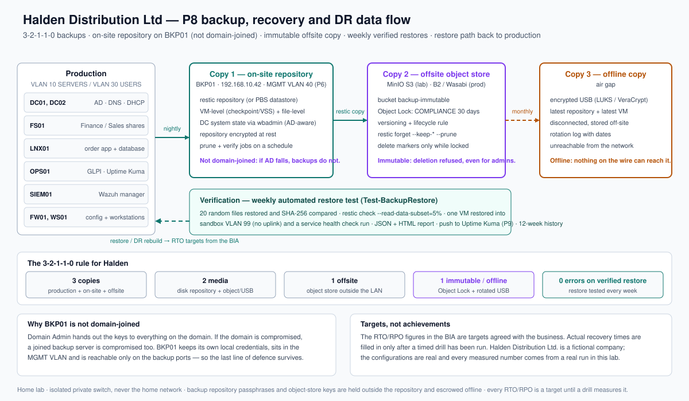

# P8: Backup, Recovery and Disaster Recovery with Automated Restore Verification

> Home-lab project in an isolated, simulated 85-user company ("Halden Distribution Ltd.").
> Presented as a home lab on the portfolio site — never as employment experience.
> Every measured number on this page comes from a real run in the lab; nothing here is invented.

**Status:** build kit complete — **lab execution pending** · **Build order:** 6 of 10 · **Depends on:** P1–P4 (P9 provides the Uptime Kuma backup heartbeat; Wazuh agent on BKP01 arrives in P7)
**Plan:** [`docs/plan/P08-backup-dr-restore-verification.md`](../../docs/plan/P08-backup-dr-restore-verification.md) · **Design:** [`docs/00-design.md`](./docs/00-design.md) · **Showcase:** [`showcase.md`](./showcase.md) · **Progress:** [`PROGRESS.md`](../../PROGRESS.md)

## Problem

Halden "has backups": a nightly copy of the file server to a USB disk plugged into the same server,
running under a Domain Admin account. Nobody has ever tried a restore. The domain controllers are not
backed up at all, and nobody knows how long the business can survive without the order system. That is
worse than having nothing, because "we have backups" is a false comfort. Attackers specifically target
backup repositories — industry research finds them targeted in around **96% of ransomware attacks**,
succeeding in about **76%** of those attempts — and ransomware appears in **88% of SMB breaches**. A
domain-joined, on-line-only, untested backup is in exactly that 76%.

## What I built

- **A Business Impact Analysis** with each department (Sales, Finance, HR, Operations, IT) that turns
  "how long can you survive without this?" into **Tier 0–3 recovery objectives per system**, signed off
  by the business rather than chosen by IT.
- **A 3-2-1-1-0 backup strategy**: three copies (production, on-site repository, off-site object store),
  two media (disk + object storage/USB), one off-site, one **immutable/offline**, and **zero errors on
  a verified restore** as the goal the whole design serves.
- **A hardened backup server (BKP01) that is deliberately not domain-joined**, with its own local
  credentials, TOTP on the console, a host firewall allowing only the backup ports from the management
  network, and an encrypted repository. If AD falls, the backups do not fall with it.
- **VM-level, file-level and domain-application-consistent backups**: virtual machines per tier, hourly
  file incrementals for the critical data, and a **system-state backup of the domain controllers** —
  the copy that enables a proper authoritative restore.
- **An immutable off-site copy** in S3-compatible object storage with a **deletion lock**, plus a
  monthly **offline** encrypted disk that no network credential can reach. The immutability is proven
  by a **failed deletion**, not asserted in a policy.
- **Automated weekly restore verification**: a sample of files is restored and hash-compared, the
  repository is integrity-checked, and one virtual machine per week is restored into an isolated
  sandbox, booted, and given a service health check. The result is published to monitoring; a failure
  raises an alert, never a silent warning.
- **Active Directory recovery drills**: a deleted object restored from the directory recycle bin, an
  authoritative restore performed in a sandbox, and the worst-case forest-recovery sequence documented
  and rehearse-able.
- **A DR runbook written for someone who did not build the lab**, plus a **timed ransomware drill**
  that measures recovery time and data loss against the agreed targets.
- **A monthly rhythm rather than a one-off**: an empty restore-test register with a fixed format, a
  reporting script whose exit code is the alert condition, and a management brief on what the business
  can now survive.

## Architecture

Production servers on VLAN 10/30 are copied nightly to an on-site encrypted repository on BKP01, which
is **not domain-joined** and lives in the management network. A second copy is synchronised to an
S3-compatible object store configured with **Object Lock**, and a third copy is rotated monthly to an
**offline** encrypted disk. The verification path (weekly restore test) sits on top of the whole chain
and is the "0" in 3-2-1-1-0: the design is only finished when a restore has been proven. Deriving the
backup plane from the domain it protects is the single most common way small companies lose everything;
keeping it separate is the point of the design.

Two details worth knowing for an interview. **Object Lock needs versioning**, so a restic delete adds a
delete marker and the locked versions survive; `prune` looks like it works while storage only shrinks
after the locks expire — which is why the lock period must be at least the recovery window promised to
the business. And **a failed deletion is the evidence**: the immutability test tries to destroy the copy
with the backup user's own credentials and records the refusal.

## How to reproduce

Run in order. Every script is lab-guarded (it refuses to run outside `ad.halden.internal` / a host
carrying `/etc/halden-lab`) and idempotent; PowerShell scripts support `-WhatIf`.

| Order | Where | Script | Does |
|---|---|---|---|
| 1 | BKP01 | `scripts/00-Prepare-BKP01.sh` | Hardens BKP01 (non-domain-joined, key-only SSH, host firewall, TOTP), prepares encrypted repository storage |
| 1b | BKP01 | `scripts/01-Configure-BackupRepository.sh` (or `--with-pbs`) | Initialises the restic repository and installs the backup, prune, verify and restore-test schedules (Option A: Proxmox Backup Server) |
| 2 | HOST01 | `scripts/02-Backup-HyperVVMs.ps1` | Application-consistent VM-level backup of the in-scope VMs to staging, per tier |
| 2b | DC01/DC02 | `scripts/03-Backup-DCSystemState.ps1` | Daily domain system-state backup (AD-aware, enables authoritative restore); records the tombstone limit |
| 3 | BKP01 | `scripts/restic-backup.sh --tier 1` | File-level backup and the source hash manifest the restore test compares against |
| 4 | BKP01 | `scripts/04-Backup-OffsiteCopy.sh --apply-lifecycle` | Copies the repository to the immutable off-site store and sets the version-expiry rule |
| 5 | BKP01 | `scripts/05-Test-Immutability.sh` | **Proves** the off-site copy cannot be deleted or its retention shortened; recovers via version rewind |
| 6 | BKP01 | `scripts/06-Test-BackupRestore.sh` | Weekly restore test: hash-checked files, repository check, sandboxed VM boot, JSON/CSV report, monitoring heartbeat |
| 7 | DC01/DC02 | `scripts/07-Restore-ADRecovery.ps1` | Directory recycle-bin restore; prints the authoritative-restore (DSRM) procedure |
| 8 | BKP01 | `scripts/08-DR-DrillTimer.sh` | Holds the stopwatch and writes the drill timing CSV against the runbook steps |
| 9 | BKP01 | `scripts/09-Push-BackupHeartbeat.sh` | Pushes the backup/restore heartbeat to Uptime Kuma (P9 hand-off) |
| 10 | BKP01 | `scripts/10-Get-BackupReport.sh` | Per-host snapshot age vs RPO, off-site presence, disk free, last restore results; exit code is the alert |

**Prerequisites:** BKP01 (Ubuntu Server 24.04, created in this project), a dedicated backup disk, a
second storage destination for the off-site copy (a MinIO virtual machine in the lab; B2/Wasabi/S3 in
production), the P1 VMs running, and a sandbox network with no uplink for restore tests.

**Secrets:** the repository passphrase, the object-store keys and the monitoring push token are read
from an **uncommitted** env file (`/etc/halden-lab/backup.env`, template: `configs/backup.env.example`) and
are held in the owner's password manager. Nothing secret is committed, and the key is also escrowed in
a sealed offline copy — losing it means losing the backups.

**Python checks:** `python3 -m unittest discover -s scripts/tests` (38 tests: the restore-result parser
and the retention-policy calculator). The retention audit is also a build check — it caught a real
inconsistency in the first draft of the policy (a four-week retention against a 30-day promise).

**Snapshot before every phase** (`snap-p8-ph<N>-before`). **Rollback:** revert that snapshot and re-run
the previous phase's scripts. For a **restore drill** the rollback is to **destroy the scratch
environment** — stop and remove the sandbox virtual machine, delete its disk and the scratch restore
folder. Nothing in production is changed by a drill; drill "damage" is simulated by reverting
snapshots, never by deleting the only copies. The offline copy and the Object Lock are deliberately
irreversible within their retention and are never removed to make a step easier.

## Results

**Not measured yet.** This build kit is written but not yet executed in the lab, so this table is
deliberately empty rather than filled with plausible-looking numbers. Each row is a real measurement
with a file in `evidence/public/` as its source, added when the phase runs. In particular there is **no
RPO/RTO achieved, no restore success rate and no drill duration** in this project yet: the targets live
in `business/p08-service-levels.md`, and the achieved values appear only after a timed drill.

| Metric | Before | After | Source |
|---|---|---|---|
| Immutable copy: deletion with backup credentials | not measured | not measured | — |
| Retention lock: attempt to clear/shorten | not measured | not measured | — |
| Weekly restore test: files hash-matched | not measured | not measured | — |
| Weekly restore test: sandboxed VM boot + service check | not measured | not measured | — |
| Recovery time vs RTO — DC01 (target 2 h) | not measured | not measured | — |
| Recovery time vs RTO — FS01 (target 4 h) | not measured | not measured | — |
| Recovery time vs RTO — LNX01 (target 4 h) | not measured | not measured | — |
| Data loss vs RPO — Tier 1 (target 1 h) | not measured | not measured | — |
| Consecutive weekly restore tests passing | not measured | not measured | — |

## Acceptance tests

| Test | Expected | Actual | Pass |
|---|---|---|---|
| Delete the immutable off-site copy with backup credentials | Deletion **refused** (object-lock protected) | not run | ☐ |
| Clear or shorten the retention lock on the immutable copy | **Refused**, even for the highest-privilege account | not run | ☐ |
| Recover the "deleted" repository from before the attempt | Repository and restore points intact | not run | ☐ |
| Restore a sample of files and compare hashes with the backup-time manifest | All sampled files match | not run | ☐ |
| Restore a virtual machine into the sandbox, boot it, run a service health check | Boots and passes all service checks | not run | ☐ |
| Restore a deleted Active Directory object from the recycle bin | Object and its children restored | not run | ☐ |
| Perform an authoritative restore in the sandbox (DSRM) | Subtree restored and replication consistent | not run | ☐ |
| Follow the DR runbook end to end, timed | Runbook usable by someone who did not build it; timings recorded | not run | ☐ |
| Reveal the recovery timing to the business only after measurement | Every published figure has a source file in `evidence/public/` | not run | ☐ |

## Business deliverables

| Artifact | For | File |
|---|---|---|
| Executive brief — can Halden survive ransomware? (targets, honestly labelled) | Managing Director decides the spend and sign-off | `business/p08-executive-brief.md` |
| Backup and recovery policy (draft for approval) | Management approval; feeds the P10 policy pack | `business/p08-backup-policy.md` |
| Disaster recovery plan with roles, order and decision points (draft, untested) | Management approval; the printed off-site copy | `business/p08-dr-plan.md` |
| Service levels — recovery objectives agreed with the business | Each department head and the MD | `business/p08-service-levels.md` |
| Restore-test register (format, with empty rows) | Evidence that backups are periodically verified | `business/p08-restore-test-register.md` |
| Change record (risk, test plan, backout) | Management and the audit trail; feeds the P10 change log | `business/p08-change-record.md` |

## Lessons learned

- **The plan's default tool assumed a different hypervisor.** P1 chose Hyper-V, so the Proxmox-Backup-
  Server option is not the default here; the design uses a restic-centric core that is hypervisor-
  agnostic, with Proxmox Backup Server and Veeam Community Edition kept as documented drop-in
  alternatives. Designing for the lab you actually have matters more than following the plan literally.
- **A policy can be internally inconsistent without anyone noticing — unless a test checks it.** The
  first draft gave Tier 2 a four-week retention while promising the business a 30-day recovery window.
  A four-line unit test on the retention calculator caught it. That is the same lesson as P1's ACL
  audit: a control that is not automated is a wish.
- **Restore is the product, not backup.** It is tempting to measure "the job ran". The only number that
  matters to the business is how long until it is working again — which is why the KPI here is a weekly
  restore test and a timed drill, and why the deletion *failure* is the immutability evidence.
- **Separating the backup plane from the domain is a design decision with a cost.** BKP01 not being
  domain-joined means another set of credentials and no single sign-on. That is a real price; the
  point is that it buys survival of the exact scenario backups exist for.
- **Write the runbook for the stranger holding it.** The DR runbook is written so a person who did not
  build this lab can follow it — including what each step's output should look like. A runbook only its
  author can use fails at the moment it is needed.

## Interview notes

**"Why 3-2-1-1-0 and not just 3-2-1?"** Because attackers target the backups: industry research finds
repositories targeted in around 96% of ransomware attacks, succeeding in about 76%. The extra "1"
guarantees a copy is **immutable or offline** — in our case object storage with a compliance-mode
deletion lock plus a rotated offline disk — so even someone holding the backup credentials cannot
destroy the history. The "0" makes **verification** a requirement: the design is not finished until a
restore has been proven, automatically, every week.

**"What does immutability actually protect against?"** A compromised backup account and ransomware that
reaches the repository. With a compliance-mode lock, a delete only writes a delete marker, the locked
versions survive, and retention cannot be shortened or cleared — not even by the highest-privilege
account — until the period expires. It does **not** protect against a wrong restore point, a lost
encryption key, or retention shorter than the recovery window promised to the business. That is why
retention must be at least the recovery window, why the key is escrowed offline, and why the restore
point is chosen from the incident timeline rather than "the newest one".

**"A director asks 'can we restore?' — what do you say?"** I do not say yes because a job is green.
I say: we restore files and hash-compare them every week, we boot a server in an isolated sandbox and
run health checks, the result goes to monitoring, and here is the history. We have also run a timed
full-recovery drill, so I can give you a number rather than a promise. And if it has not been measured
yet, the honest answer is "not measured — here is the target and the date we will prove it", which is
exactly what this page does.

**"How did you decide the RTO and RPO?"** I did not — the business did, through the Business Impact
Analysis. I interviewed each department, explained the cost of each option, and they chose: the order
system gets a one-hour data-loss window because orders cannot be re-entered cheaply, while the
directory gets 24 hours because replication covers most of the gap and the *recovery time* is what
matters there. My job was to make the trade-off legible and then engineer to it.
