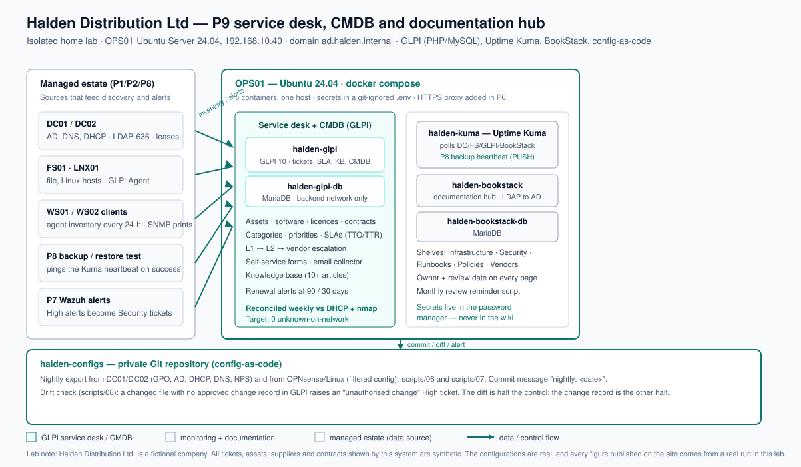

# P9: IT Service Desk, Asset Inventory (CMDB) and Documentation Hub

> Home-lab project in an isolated, simulated 85-user company ("Halden Distribution Ltd.").
> Presented as a home lab on the portfolio site — never as employment experience.
> All tickets, assets, suppliers and contracts used here are **synthetic**
> (see [`data/README.md`](./data/README.md)).

**Status:** build kit complete — **lab execution pending** · **Build order:** 3 of 10 · **Depends on:** P1 (AD/DNS/DHCP, the discovery source), P2 (joiner/mover/leaver for the new-starter form)
**Plan:** [`docs/plan/P09-service-desk-cmdb-documentation.md`](../../docs/plan/P09-service-desk-cmdb-documentation.md) · **Design:** [`docs/00-design.md`](./docs/00-design.md) · **Site page source:** [`showcase.md`](./showcase.md)

## Problem

At Halden, support requests arrive by email, Teams, WhatsApp and by people walking up to the desk.
Nothing is tracked, so nobody knows the workload, what keeps breaking, or whether a user waits an
hour or a week. The asset spreadsheet no longer matches reality — which is not just untidy, because
an asset nobody tracks is an asset nobody patches — and the firewall support contract expired
unnoticed because no one owned the renewal. When the previous IT person left, the documentation left
with them.

A support function with no records cannot be improved, staffed or defended at budget time, and CIS
Controls 1 and 2 (asset and software inventory) are the first two safeguards an SMB is measured
against. This project gives Halden one platform to run support, know its estate, hold its
documentation and keep configuration under control.

## What I built

- **GLPI (PHP + MariaDB) on OPS01** as the single service desk and CMDB, deployed as a Docker
  Compose stack with a git-ignored `.env` and **LDAP/LDAPS authentication** to `ad.halden.internal`
  (group mapping: `G_IT_ServiceDesk`/`G_IT_SysAdmin` → Technician, everyone else → Self-Service).
- **A service catalogue** of nine services with request forms, approval routes and target times,
  defined once in `configs/glpi-service-catalogue.json` and applied to GLPI by a script.
- **Priority-based SLAs on a business calendar** (Mon–Fri 08:00–18:00): P1 15 min / 4 h, P2 1 h / 8 h,
  P3 4 h / 2 days, P4 1 day / 5 days, with automatic escalation to L2 at 75% of TTR. The deadline
  arithmetic (weekend/holiday rollover) is covered by unit tests.
- **An L1 → L2 → vendor escalation matrix** with a handoff template, so a ticket carries everything
  the next person needs.
- **Agent-based asset discovery** with the GLPI Agent (Windows MSI via GPO, Linux package + systemd
  timer, SNMP for printers and network gear) and a **weekly reconciliation** script that compares the
  CMDB against DHCP leases and an `nmap` sweep — target **0 unknown-on-network**.
- **A CMDB drift check** that compares the register against AD computer objects, DNS A records and
  DHCP reservations, so the CMDB is tested against the P1 domain itself, not only the network.
- **A vendor, contract and licence register** (fictional suppliers) with renewal alerts at 90 and 30
  days and a licence right-sizing view (seats installed vs seats owned).
- **BookStack as the documentation hub** for the P1–P8 as-built docs, runbooks and diagrams, with a
  page template that carries an owner and a review date, and a monthly review reminder.
- **Uptime Kuma** for monitoring — installed in P9 (not P7) so the P8 backup heartbeat exists when
  the backup project needs it.
- **Config-as-code with drift detection**: a nightly export of GPO, AD, DHCP, DNS, firewall and NPS
  configuration to a private Git repository, and a check that raises an **unauthorised-change** ticket
  when a changed file has no approved change record.
- **Business deliverables**: the service catalogue, an SLA policy, an escalation matrix, a vendor
  management procedure, a one-page executive brief, a change record and a KPI definition sheet (with
  no invented values).

## Architecture



OPS01 runs five containers: **halden-glpi** (GLPI 10 — tickets, SLA, knowledge base, CMDB) with
**halden-glpi-db** (MariaDB, backend network only), **halden-kuma** (Uptime Kuma, including the P8
backup heartbeat) and **halden-bookstack** with **halden-bookstack-db** (the documentation hub).
The P1 estate feeds it — DHCP leases, AD objects, agent inventory and SNMP — while P7 alerts and the
P8 restore test create tickets automatically. Configuration flows the other way, out to the private
`halden-configs` Git repository every night. The lab is never exposed to the internet: the UIs bind
to `127.0.0.1` until the P6 reverse proxy and certificate exist.

The one piece of code that makes the CMDB trustworthy is the reconciliation classifier — three
sources, one verdict per device:

```powershell
$status = if ($onNet -and -not $inGlpi) { 'Unknown-OnNetwork' }        # on the network, not in the CMDB
          elseif ($inGlpi -and -not ($onNet -or $inDhcp)) { 'Stale-InGlpi' }
          else { 'Matched' }
```

The script exits with the number of unknown devices as its exit code, so "0 unknown" is a test
result, not a claim.

## How to reproduce

Run in order. Every script is idempotent, lab-guarded (it refuses to run outside
`ad.halden.internal` / a host carrying `/etc/halden-lab`) and, for the PowerShell scripts, supports
`-WhatIf` or a dry run.

| Order | Where | Script | Does |
|---|---|---|---|
| 0 | OPS01 | `scripts/00-Prepare-OPS01.sh` | Installs Docker + Compose, creates `/opt/halden`, seeds the git-ignored `.env` |
| 1 | OPS01 | `scripts/01-Deploy-ServiceDeskStack.sh` | Brings up GLPI, Uptime Kuma and BookStack; refuses to run with placeholder secrets |
| 2 | management host | `python3 scripts/03-configure_glpi_sla.py` (dry run) then `--apply` | Configures SLAs, priorities and business rules in GLPI |
| 3 | DC01/mgmt | `scripts/02-Test-AssetReconciliation.ps1` | Reconciles the CMDB against DHCP + `nmap`; exit code = unknown devices |
| 4 | DC01/mgmt | `scripts/05-Test-CmdbDrift.ps1` | Compares the CMDB against AD, DNS and DHCP reservations |
| 5 | management host | `python3 scripts/04-seed-synthetic-tickets.py` (`--apply` to POST) | Generates the synthetic ticket set for the reports |
| 6 | OPS01 | `scripts/09-Backup-ServiceDeskDb.sh` | Nightly dump of the GLPI and BookStack databases, with checksums and retention |
| 7 | OPS01 | `scripts/10-Seed-BookStack.sh` | Creates the documentation shelves and books |
| 8 | DC01 | `scripts/06-Export-HaldenConfigs.ps1` | Nightly export of GPO, AD, DHCP, DNS and NPS to the Git working copy |
| 9 | OPS01 | `scripts/07-export-configs.sh` | Linux + filtered OPNsense config export to the same repository |
| 10 | DC01 | `scripts/08-Test-ConfigDrift.ps1` | Flags changed config with no approved change record (drift detection) |
| 11 | OPS01 | `python3 data/gen_synthetic_data.py` | Regenerates the synthetic asset and ticket datasets |

**Prerequisites:** OPS01 as an Ubuntu Server 24.04 VM with Docker; the P1 domain for LDAPS, DHCP
leases and AD objects; a management host with PowerShell 7, RSAT (`AD`, `DnsServer`, `DhcpServer`)
and `nmap`; `python3` (the tests use only the standard library). Secrets — GLPI/BookStack database
passwords, API tokens and the Uptime Kuma push token — are entered into the git-ignored `.env` and
stored in the owner's password manager, **never** in the repository.

**Snapshot before every phase** (`snap-p9-ph<N>-before`). **Rollback:** revert the OPS01 snapshot
(OPS01 is not a domain controller, so this is low risk) and re-run the previous phase's scripts,
which are idempotent. Stopping the stack with `docker compose down` keeps the data volumes; a full
data restore uses `docs/runbooks/restore-service-desk-database.md`.

## Results

**Not measured yet.** This build kit has been written but not yet executed in the lab, so this table
is deliberately empty rather than filled with plausible-looking numbers. Each row is a real
measurement with a file in `evidence/public/` as its source, added when the phase runs.

| Metric | Before | After | Source |
|---|---|---|---|
| Devices discovered automatically by the GLPI Agent | not measured | not measured | — |
| Reconciliation: unknown-on-network devices (target 0) | not measured | not measured | — |
| Software titles flagged as unauthorised (CIS 2.3) | not measured | not measured | — |
| SLA compliance — TTO | not measured | not measured | — |
| SLA compliance — TTR | not measured | not measured | — |
| First-contact resolution | not measured | not measured | — |
| Knowledge-base articles published | not measured | not measured | — |
| Contracts with a renewal alert at 90/30 days | not measured | not measured | — |
| Unauthorised configuration changes detected | not measured | not measured | — |
| Service-desk database restore verified | not measured | not measured | — |

## Acceptance tests

| Test | Expected | Actual | Pass |
|---|---|---|---|
| Weekly reconciliation against DHCP + `nmap` | 0 unknown-on-network devices | not run | ☐ |
| Install a non-approved application on a client | Appears in the unauthorised-software report | not run | ☐ |
| Raise a P2 ticket and let its TTR reach 75% | L2 notified, status Escalated | not run | ☐ |
| Submit the new-starter form | Ticket created, approval requested, task references the P2 JML run | not run | ☐ |
| Let a contract cross the 90-day notice line | Renewal alert raised | not run | ☐ |
| Change a firewall rule with no change record | Next drift check raises an unauthorised-change High ticket | not run | ☐ |
| Re-run `scripts/00-Prepare-OPS01.sh` and the seed scripts | Idempotent: no duplicates, no errors | not run | ☐ |
| Restore the service-desk database from the nightly dump | GLPI and BookStack recover with data intact | not run | ☐ |

## Business deliverables

| Artifact | For | File |
|---|---|---|
| Service catalogue (services, owners, approvals, targets) | Staff and department heads | `business/p09-service-catalogue.md` |
| SLA policy (priority matrix, business hours, targets, escalation) | Management approval | `business/p09-sla-policy.md` |
| L1/L2/vendor escalation matrix with the handoff template | The service desk | `business/p09-escalation-matrix.md` |
| Vendor management procedure | Management / audit trail | `business/p09-vendor-management.md` |
| ITSM executive brief (1 page) | Managing Director | `business/p09-itsm-brief.md` |
| Change record (risk, test plan, backout) | Management / audit trail; feeds P10 | `business/p09-change-record.md` |
| KPI and reporting definitions (no invented values) | Monthly reporting | `business/p09-kpi-reporting.md` |

## Lessons learned

- **A catalogue is a contract, so it comes before the software.** Writing the service list, the
  priority matrix and the escalation route first meant GLPI was configured to a decision the business
  had already made, not the other way round.
- **Business hours are the whole of an SLA.** "8 hours" without a calendar is really an overnight
  commitment nobody intended; making the calendar explicit, and covering the weekend rollover with
  unit tests, turned a target into something defensible.
- **An asset register is only true on the day you reconcile it.** Reconciliation had to be designed
  as comparing three sources (CMDB, DHCP, network) and reporting, not as a one-off import — the same
  script that proves 0 unknown also keeps it true next week.
- **Config-as-code needs the change record to be useful.** A nightly diff that flags every change is
  noise; a diff checked against approved change records is a control. Splitting "something changed"
  from "an approved change changed it" is what makes the drift alert worth acting on.
- **The wiki is where secrets go to leak.** Documenting that credentials live in the password manager,
  and filtering the OPNsense export before it can ever be committed, were both decisions worth making
  before the first commit rather than after.

## Interview notes

**"How do you support an L1 team?"** Good knowledge-base articles, a clear escalation matrix with a
handoff template, and turning recurring escalations into a KB article or a permanent fix. In P9 the
handoff template names exactly what to include (ticket, requester, priority, impact, symptom, what
was tried, affected item), so a ticket is never bounced back for missing information, and three or
more tickets for the same fault triggers a problem record instead of a fourth workaround.

**"How do you keep the asset register accurate?"** I do not trust a typed list. A weekly script
compares the CMDB against live DHCP leases (`Get-DhcpServerv4Lease`) and an `nmap -sn` sweep, and
classifies every device as Matched, Unknown-OnNetwork or Stale-InGlpi; the exit code is the number of
unknown-on-network devices, with a target of 0. A second check compares the CMDB against AD computer
objects, DNS A records and DHCP reservations, so a device with no CMDB record stands out. The scripts
report; retiring or adding a record is a reviewed manual step.

**"Someone changed the firewall and didn't tell anyone."** The nightly config export commits GPO, AD,
DHCP, DNS, firewall and NPS configuration to a private Git repository. The next morning the drift
check lists the changed files and looks for an approved change record in GLPI covering that date; a
changed file with no matching record raises an "unauthorised change" High ticket. I demo it by
changing a firewall rule without a change record and showing the alert — the diff is half the control
and the change record is the other half.

**"How do you define and prove an SLA?"** An SLA is Impact × Urgency into four priorities, each with
a Time To Own and a Time To Resolve target, measured in business hours on a calendar (Mon–Fri
08:00–18:00). P1 is 15 minutes to own and 4 hours to resolve through to P4 at one and five business
days, with automatic escalation to L2 at 75% of the TTR. Because the calendar matters, the deadline
maths — including weekend and holiday rollover — is unit-tested, so a ticket opened late on a Friday
gets the same answer from the software and from the policy. Compliance itself is only reported from
real ticket data, never assumed.
