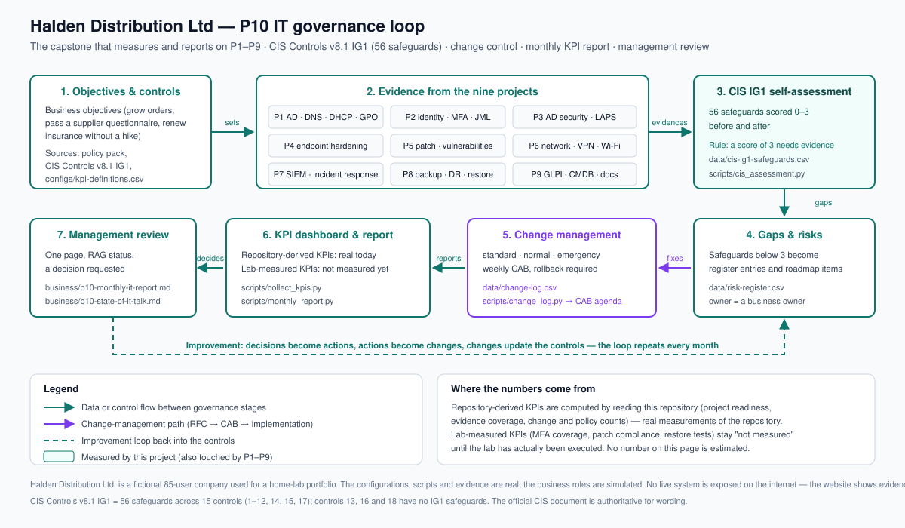

## The problem

Nine good technical projects are worthless if management still cannot answer four questions: are we
secure, are we getting better, what does IT need money for, and what changed last week — and who
approved it? At Halden, IT work happened but was invisible; changes were made on a Friday afternoon
without telling anyone; and there were no written policies, which the cyber-insurance renewal
questionnaire now asks for. CIS describes **IG1 (56 safeguards)** as essential cyber hygiene and an
emerging minimum standard for every enterprise — a natural baseline for a business this size, and one
Halden had no way to measure itself against (`docs/plan/00-research-and-selection.md`).

## What I built

- **A CIS Controls v8.1 IG1 self-assessment** across all **56** safeguards in 15 controls, scored
  before and after, where "fully implemented" **requires a named evidence source** — the assessment
  tool refuses the score otherwise.
- **An evidence map** that traces every safeguard to the artifact from P1–P9 that will evidence it,
  plus an indexer that reports which of those artifacts exist today (16 of 56 at the time of writing —
  expected, because the lab has not been executed).
- **ITIL-style change management**: standard, normal and emergency types, a risk-classified RFC, a
  CAB agenda generated from the register, a change calendar with freeze periods, and a mandatory
  retrospective for emergency changes. A change with no rollback plan cannot be approved.
- **A ten-policy IT policy pack** a small company could actually adopt: 1–2 pages each, plain English,
  with an owner, a version, a review date, an acknowledgement process and an exceptions register.
- **A 27-KPI governance pipeline** that separates *repository-derived* KPIs — genuine, reproducible
  measurements of this repository — from *lab-measured* KPIs, which report as "not measured" until the
  lab has run and are never estimated.
- **A monthly management report** generated in Python that **refuses to render** if any evidence file
  it would cite is missing, so a report can never point at a source that does not exist.
- **A risk register and consolidated action tracker**, with a documented scoring methodology and the
  rule that a business risk is owned by a business owner, never by IT.
- **A "State of IT" talk outline** — 12 slides with speaker notes, a costed 90-day roadmap and a clear
  decision request, written for a non-technical audience.
- **Lab collection tooling** — a read-only PowerShell collector for the Active Directory evidence, a
  bash pre-flight gate and an evidence collector, all lab-guarded and writing nothing back to the lab.

## How it works



The loop is the point: business objectives set the controls; the nine projects supply evidence; the
evidence is scored against CIS IG1; gaps become risks and roadmap items; change management controls how
the environment changes; the KPI dashboard and monthly report turn results into a management decision;
and management review feeds improvement back into the controls.

The single rule that makes it honest is enforced in code rather than in a spreadsheet template:

```python
# A safeguard is only "fully implemented and evidenced" when a named source backs it.
if value == 3 and not (s.evidence_source or s.artifact_path):
    assessment.errors.append(
        f"safeguard {s.safeguard_id} is scored 3 ({which}) but names no evidence source"
    )
```

That one check is why the scorecard can be trusted: producing an inflated number is harder than
producing an honest one.

## Results

**Not measured yet.** The build kit (scripts, configs, runbooks, business artifacts and the governance
diagrams) is complete, and lab execution is pending. I am deliberately not publishing numbers before
they exist: the CIS IG1 before/after scorecard and every operational KPI are added here only from real
lab runs, each with a file in `evidence/public/` as its source. The before/after chart is a clearly
labelled **empty template** for the same reason.

| Metric | Before | After | Source |
|---|---|---|---|
| CIS IG1 implementation, % evidenced (56 safeguards) | not measured | not measured | pending |
| Change success rate | not measured | not measured | pending |
| Emergency change share | not measured | not measured | pending |
| Actions closed on time, % | not measured | not measured | pending |

**Repository-derived counts** (a separate, reproducible class — measurements of this repository, not
lab results; reproduce with `python3 projects/p10-governance/scripts/collect_kpis.py`):

| Repository-derived count | Value at 2026-10-02 |
|---|---|
| CIS IG1 safeguards in the assessment input | 56 |
| Safeguards scored (before / after) | 0 / 0 |
| Safeguards whose expected evidence artifact exists today | 16 of 56 |
| Change records / awaiting approval | 1 / 1 |
| Policies registered / approved | 10 / 0 |

## Business side

The deliverables are the reason this project exists — a governance programme that produces no paperwork
for management has not happened:

- **Executive summary (1 page)** — IT at a glance for the board: what was built across the nine
  projects, in business language, with no invented metrics.
- **IT policy pack** — ten short policies (information security, acceptable use, access control,
  privileged access, endpoint, patching, network, logging and incident response, backup, change and
  asset management), ready for management approval with a staff acknowledgement process and an
  exceptions register.
- **CIS IG1 self-assessment report** — the structure, with the status column deliberately empty and an
  explanation of exactly how it will be filled and evidenced.
- **Monthly IT report** — the real first edition, carrying only what the repository genuinely supports
  today, and stating plainly that the projects are awaiting lab execution.
- **CAB minutes** — the agenda, decisions and actions for the change this programme represents, with
  decisions marked *pending* because no real approval has happened.
- **Risk register and methodology** — how a risk is written, scored, owned and treated, with the
  register itself empty rather than filled with plausible-looking examples.
- **"State of IT" talk** — a 12-slide outline with speaker notes and a costed 90-day roadmap, for the
  recorded management briefing.

## What I learned / what I'd do differently

- **Governance is what makes the other nine projects credible.** Writing the rule "a score of 3 needs
  evidence" into the tooling changed how I think about every other project: a claim that cannot survive
  "where did that come from?" is not a result.
- **I would design the policy pack before the technical work next time.** Several projects made
  decisions that a written access-control or endpoint standard would have settled in advance, and the
  policies were easier to write once I could point at real configurations.
- **The hardest judgement was what *not* to measure.** A KPI nobody can act on is noise. Splitting the
  set into repository-derived and lab-measured was the most useful design decision here — it lets the
  report be truthful today instead of plausible tomorrow.
- **Leaving approval blocks unsigned is the harder, better choice.** It was tempting to fill the CAB
  and policy approvals with a plausible signature; leaving them visibly empty, with the reason
  written down, is the artefact I would defend in an interview.

> Status: **in progress**. The build kit (scripts, configs, runbooks, business artifacts) is
> complete; lab execution runs phase by phase. Metrics, diagrams and evidence are published only
> from real runs (the Definition of Done is in `AGENTS.md`, Section 4.7), and progress is tracked
> in `PROGRESS.md`.
